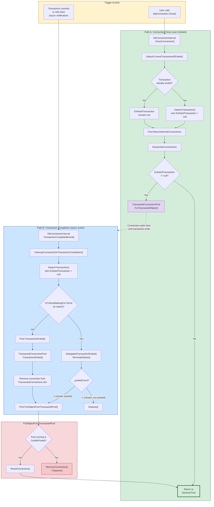

# Connection Return and Cleanup Paths

Every code path that moves a connection from "in use" to "somewhere else," and what transaction state the connection is in at each point.

## Paths Inventory

| Trigger | Entry Point | Transaction State | Destination |
|---------|-------------|-------------------|-------------|
| User calls `SqlConnection.Close()` | `DbConnectionInternal.CloseConnection()` | May be enlisted or not | Transacted pool or idle pool |
| Transaction commits/rolls back | `TransactionCompletedEvent` | Enlisted → detaching | `PutObjectFromTransactedPool` → idle or destroy |
| Pool pruning timer | `CleanupCallback` | May be transaction root | Destroy or stasis (WaitHandle only) |
| Pool shutdown | `Shutdown()` → affects `DeactivateObject` | May be transaction root | Destroy or stasis (WaitHandle only) |
| Pool clear (`SqlConnection.ClearPool`) | `Clear()` | May be enlisted | Doom + destroy |
| Connection reclamation (GC/leak) | `ReclaimEmancipatedObjects` | May be transaction root | Destroy or stasis |
| Load balance timeout | Sets `DoNotPool` | May be enlisted | Next return → destroy |
| `ReplaceConnection` | Creates new, removes old | Old may be enlisted | Old destroyed, new activated |

## Path A: User closes connection (`SqlConnection.Close()`)

1. `DbConnectionInternal.CloseConnection()` is called.
2. `DetachCurrentTransactionIfEnded()` checks if the enlisted transaction is already dead — if so, clears `EnlistedTransaction` right there.
3. `Pool.ReturnInternalConnection()` is called, which calls `DeactivateConnection()` and then checks `EnlistedTransaction`:
   - **If still enlisted** (transaction is active): the connection goes to `TransactedConnectionPool.PutTransactedObject()` where it waits until Path B fires.
   - **If not enlisted** (transaction already ended or none): returns directly to the general pool.

## Path B: Transaction completes asynchronously

The `TransactionCompleted` event fires on `DbConnectionInternal`, which calls `CleanupConnectionOnTransactionCompletion()`. Two sub-paths:

### B1 — Normal path (connection is in the transacted pool)

1. `DetachTransaction()` clears `EnlistedTransaction`.
2. `Pool.TransactionEnded()` → `TransactedConnectionPool.TransactionEnded()` removes the connection from the `TransactedConnections` dictionary.
3. `Pool.PutObjectFromTransactedPool()` calls `ResetConnection()` and returns it to the general pool.

### B2 — Stasis path (delegated transaction root)

Applies when a connection is a delegated transaction root that was put in stasis because it had nowhere to go.

1. `DetachTransaction()` sees `IsTxRootWaitingForTxEnd == true`.
2. `DelegatedTransactionEnded()` fires, calls `TerminateStasis()`, then:
   - If `_pooledCount == 1` (closed, pooled): calls `Pool.PutObjectFromTransactedPool()` → general pool.
   - If `_pooledCount == -1` (closed, non-pooled): calls `Dispose()`.

## Path C: Pool pruning (`CleanupCallback`)

1. Timer pops old connections from the idle stack.
2. For each: checks `IsTransactionRoot` under lock.
   - If true: `SetInStasis()` — can't destroy, transaction is still running.
   - If false: `DestroyObject()`.

## Convergence: `PutObjectFromTransactedPool`

All post-transaction return paths funnel through `PutObjectFromTransactedPool()`:
- **Pool running + `CanBePooled`**: `ResetConnection()` → general pool.
- **Otherwise**: destroy/dispose.

## Race: Close and TransactionCompleted fire simultaneously

`CloseConnection()` calls `DetachCurrentTransactionIfEnded()` before returning to the pool. If the transaction has already completed, the connection goes straight to the general pool via Path A (with `EnlistedTransaction == null`). If the transaction is still active, the connection parks in the transacted pool and Path B handles the return. The lock inside `DetachTransaction()` on the transaction object prevents both paths from racing.

## Diagram



## Key Source Files

| File | Relevant methods |
|------|-----------------|
| `src/.../ProviderBase/DbConnectionInternal.cs` | `CloseConnection`, `DetachCurrentTransactionIfEnded`, `DetachTransaction`, `TransactionCompletedEvent`, `CleanupConnectionOnTransactionCompletion`, `DelegatedTransactionEnded`, `SetInStasis` |
| `src/.../ConnectionPool/TransactedConnectionPool.cs` | `GetTransactedObject`, `PutTransactedObject`, `TransactionEnded` |
| `src/.../ConnectionPool/WaitHandleDbConnectionPool.cs` | `DeactivateObject`, `DestroyObject`, `PutObjectFromTransactedPool`, `TransactionEnded`, `GetFromTransactedPool`, `CleanupCallback` |
| `src/.../ConnectionPool/ChannelDbConnectionPool.cs` | `ReturnInternalConnection`, `RemoveConnection`, `PutObjectFromTransactedPool`, `TransactionEnded`, `GetFromTransactedPool` |

## WaitHandle vs Channel: Return Path Comparison

### WaitHandle pool (DeactivateObject) — 7 branches, 3 enter stasis

```
DeactivateObject(connection):
├── IsConnectionDoomed? → DESTROY
└── lock(connection)
    ├── Pool ShuttingDown?
    │   ├── IsTransactionRoot? → STASIS
    │   └── else → DESTROY
    └── Pool active
        ├── IsTransactionRoot && Pool == null? → STASIS
        ├── CanBePooled?
        │   ├── EnlistedTransaction != null? → TRANSACTED POOL
        │   └── else → GENERAL POOL
        └── !CanBePooled
            ├── IsTransactionRoot && !Doomed? → STASIS
            └── else → DESTROY
```

### Channel pool (ReturnInternalConnection) — 5 branches, 0 enter stasis

```
ReturnInternalConnection(connection):
├── !IsLiveConnection? → REMOVE
├── IsConnectionDoomed? → REMOVE
├── CanBePooled?
│   └── lock(connection)
│       ├── EnlistedTransaction != null? → TRANSACTED POOL
│       ├── ShuttingDown? → REMOVE
│       └── else → IDLE CHANNEL
├── ShuttingDown? → REMOVE
└── else → REMOVE
```

The Channel pool has no stasis — non-poolable transaction roots are destroyed immediately. Stasis gaps are tracked in `03-design/pool-comparison-and-decisions.md`.
