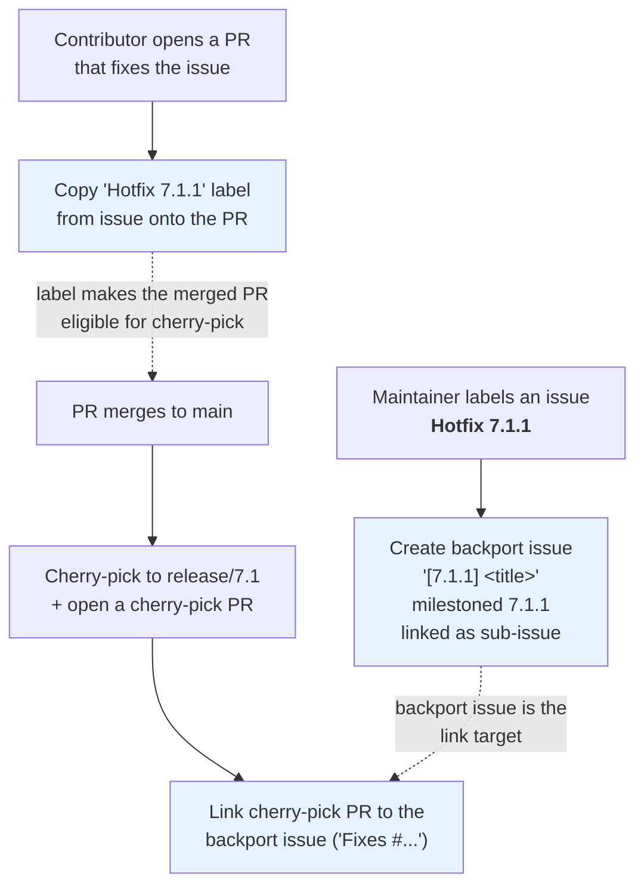

# Hotfix Label Automation

Three workflows work together to automate backporting a fix from an issue
through to a merged cherry-pick PR, all keyed off a single `Hotfix X.Y.Z`
label.

## Steps

1. **Labeling an issue `Hotfix X.Y.Z`** creates a child "backport issue"
   titled `[X.Y.Z] <original title>`, milestoned to `X.Y.Z`, and linked as a
   native GitHub sub-issue of the parent. Re-adding the label (or re-running)
   is a no-op if a backport issue for that milestone already exists.

2. **Opening a PR that closes the labeled issue** (via `Fixes`/`Closes`/
   `Resolves #N`) automatically copies the issue's `Hotfix X.Y.Z` label onto
   the PR. Contributors never have to remember to label the PR by hand.

3. **Merging that labeled PR** cherry-picks it onto `release/X.Y` and opens
   a `[X.Y.Z Cherry-pick] <title>` PR. That cherry-pick PR is automatically
   linked to the backport issue from step 1 (`Fixes #<backport issue>`), so
   merging it closes out the release tracking issue too.

## Why sub-issues (not just linking)

Using GitHub's native sub-issue relationship (rather than a plain
cross-reference) lets the backport issue be discovered purely from the
parent issue's sub-issue list at cherry-pick time, without depending on the
PR body text, comment history, or any other stateful link that could be
edited or go missing.
