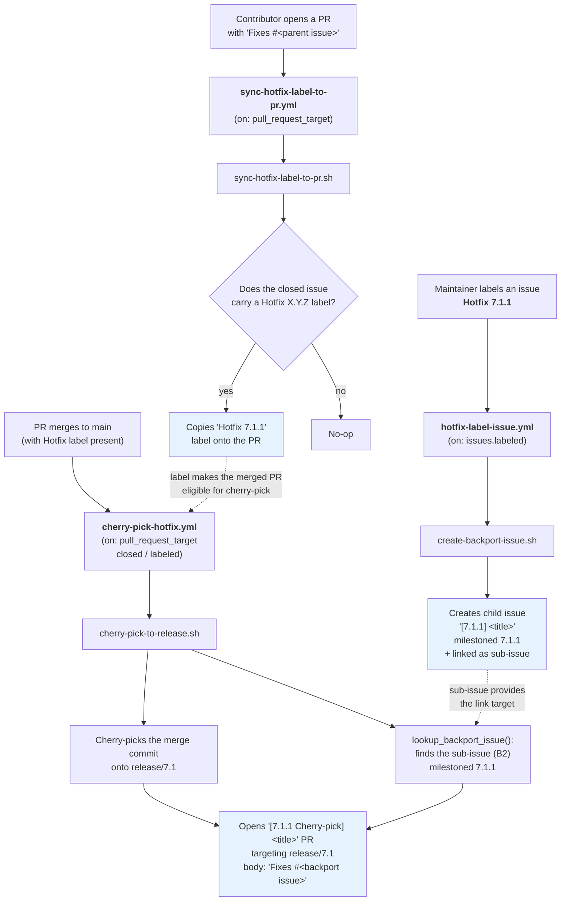

# Hotfix Label Automation

Three workflows work together to automate backporting a fix from an issue
through to a merged cherry-pick PR, all keyed off a single `Hotfix X.Y.Z`
label.

## Steps

1. **[`hotfix-label-issue.yml`](hotfix-label-issue.yml)** fires when an issue
   receives a `Hotfix X.Y.Z` label. It runs
   [`create-backport-issue.sh`](../scripts/create-backport-issue.sh), which
   creates a child "backport issue" titled `[X.Y.Z] <original title>`,
   milestones it to `X.Y.Z`, and links it as a native GitHub sub-issue of the
   parent. If the label is later removed and re-added (or the workflow
   re-runs), a duplicate-guard skips creating a second backport issue for the
   same milestone.

2. **[`sync-hotfix-label-to-pr.yml`](sync-hotfix-label-to-pr.yml)** fires when
   a pull request is opened, reopened, edited, or synchronized. It runs
   [`sync-hotfix-label-to-pr.sh`](../scripts/sync-hotfix-label-to-pr.sh),
   which inspects the PR's closing keywords (`Fixes`/`Closes`/`Resolves #N`)
   and, for any referenced issue in this repository that carries a
   `Hotfix X.Y.Z` label, copies that label onto the PR itself. This means a
   contributor never has to remember to label the PR by hand: the parent
   issue's label is enough.

3. **[`cherry-pick-hotfix.yml`](cherry-pick-hotfix.yml)** fires when a labeled
   PR is merged (or a `Hotfix X.Y.Z` label is added after merge). It runs
   [`cherry-pick-to-release.sh`](../scripts/cherry-pick-to-release.sh), which
   cherry-picks the merge commit onto `release/X.Y` and opens a
   `[X.Y.Z Cherry-pick] <title>` PR. `lookup_backport_issue()` looks up the
   sub-issue created in step 1 and appends a `Fixes #<backport issue>` line
   to the cherry-pick PR body, so merging the cherry-pick automatically
   closes the backport issue tracking that release.

## Why sub-issues (not just linking)

Using GitHub's native sub-issue relationship (rather than a plain
cross-reference) lets the backport issue be discovered purely from the
parent issue's sub-issue list at cherry-pick time, without depending on the
PR body text, comment history, or any other stateful link that could be
edited or go missing.
