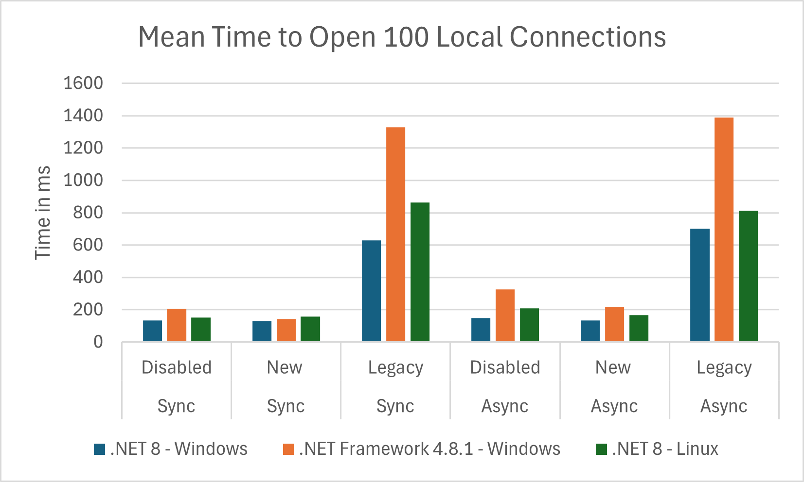
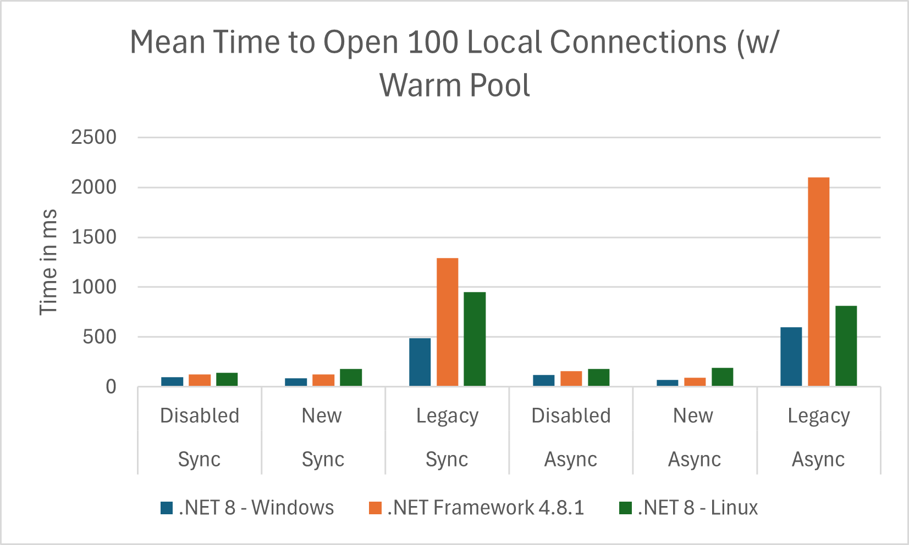
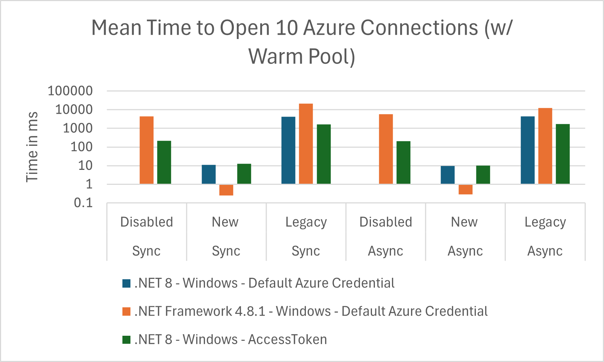
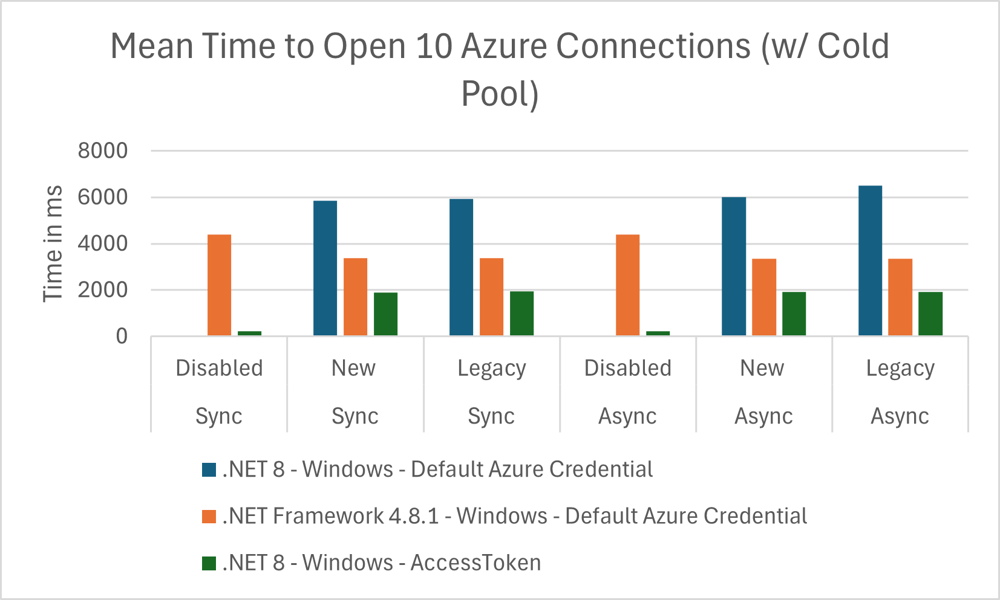
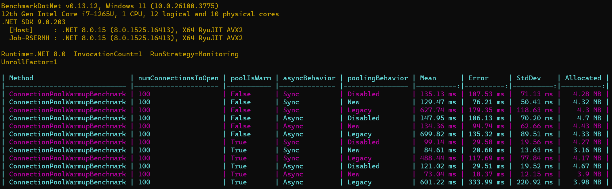
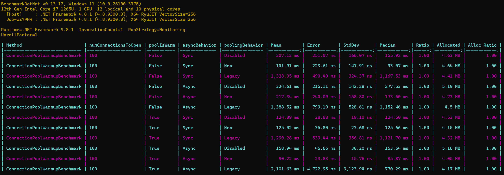
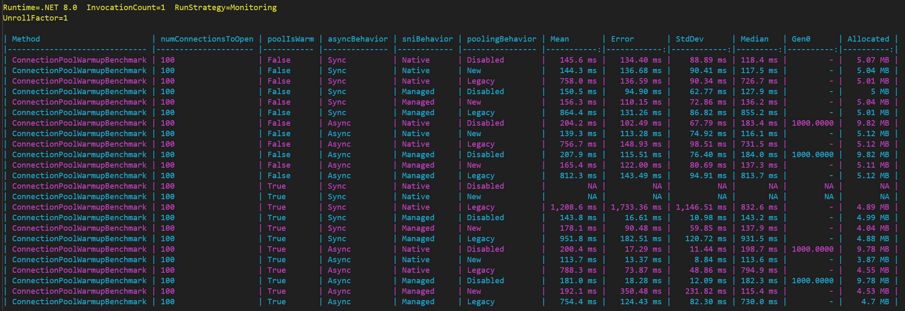
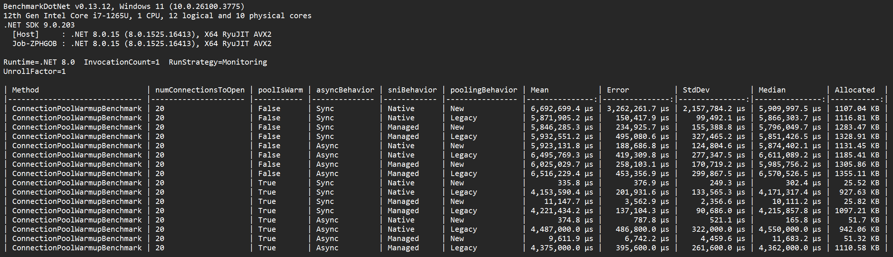
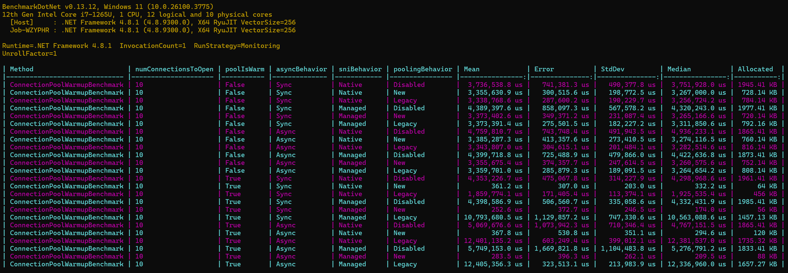
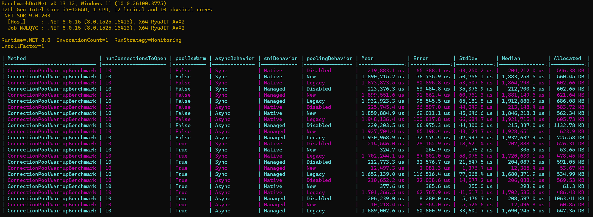

# Design Document: `ChannelDbConnectionPool`
## Problem Statement
The current connection pool implementation is slow to open new connections and does not follow async best practices.

Connection opening is serialized, causing delays when multiple new connections are required simultaneously. This is done using a semaphore to rate limit connection creation. When multiple new connections are requested, they queue up waiting for the semaphore. Once acquired, the thread opens the connection and releases the semaphore, allowing the next thread to proceed. This approach was initially designed to prevent overwhelming the server but can lead to significant delays, especially in high-latency environments.

Async requests are also serialized through an additional queue. When an async request is made, it is added to a queue, and a reader thread processes these requests one by one. This method was chosen due to the lack of async APIs in native SNI, resulting in synchronous handling of async requests on a dedicated thread.

## Design Goals
- Enable parallel connection opening.
- Minimize thread contention and synchronization overhead.
- Follow async best practices to reduce managed threadpool pressure and enable other components of the driver to modernize their async code.

## Overview
The core of the design is the Channel data structure from the [System.Threading.Channels library](https://learn.microsoft.com/en-us/dotnet/core/extensions/channels) (available to .NET Framework as a nuget package) (Also see Stephen Toub's intro [here](https://devblogs.microsoft.com/dotnet/an-introduction-to-system-threading-channels/)). Channels are thread-safe, async-first queues that fit well for the connection pooling use case.

A single channel holds the idle connections managed by the pool. A channel reader reads idle connections out of the channel to vend them to SqlConnections. A channel writer writes connections back to the channel when they are returned to the pool.

Pool maintenance operations (warmup, pruning) are handled asynchronously as Tasks.

Transaction-enlisted connections are stored in a separate dictionary data structure, in the same manner as the WaitHandleDbConnectionPool implementation.

This design is based on the [PoolingDataSource](https://github.com/npgsql/npgsql/blob/main/src/Npgsql/PoolingDataSource.cs) class from the npgsql driver. The npgsql implemenation is proven to be reliable and performant in real production workloads. 

### Why the Channel Data Structure is a Good Fit

1. **Thread-Safety**:
   Channels are designed to facilitate thread-safe communication between producers (e.g., threads returning connections to the pool) and consumers (e.g., threads requesting connections). This eliminates the need for complex locking mechanisms, reducing the risk of race conditions and deadlocks.

2. **Built-In Request Queueing**:  
   Channels provide a succinct API to wait asynchronously if no connections are available at the time of the request.

3. **Asynchronous Support**:  
   Channels provide a robust async API surface, simplifying the async paths for the connection pool.

4. **Performant**:  
   Channels are fast and avoid extra allocations, making them suitable for high throughput applications: https://devblogs.microsoft.com/dotnet/an-introduction-to-system-threading-channels/#performance

## Workflows
1. **Warmup**:
New connections are written to the tail of the idle channel by an async task.

2. **Acquire Connection**:
Idle connections are acquired from the head of the idle channel.

3. **Release Connection**:
Connections that are released to the pool are added to the tail of the idle channel.

4. **Pruning**:
Connections are pruned from the head of the idle channel.

.png>)

## Performance Benchmarks
Note: All graphed results use managed SNI. See full results below for native SNI.

The channel based implementation shows significant performance improvements across frameworks and operating systems. In particular, interacting with a warm pool is much faster.

When interacting with a cold pool and connecting to an Azure database, performance is equivalent to the legacy implementation *provided enough threads are made available in the managed threadpool*. This requirement highlights a bottleneck present further down the stack when acquiring federated auth tokens.

### Windows - .NET 8.0

### Windows - .NET Framework 4.8.1

### Linux - net8.0

### Windows - net8.0 - AzureSQL - Default Azure Credential

### Windows - .NET Framework 4.8.1 - AzureSQL - Default Azure Credential

### Windows - NET 8.0 - Azure SQL - AccessToken
