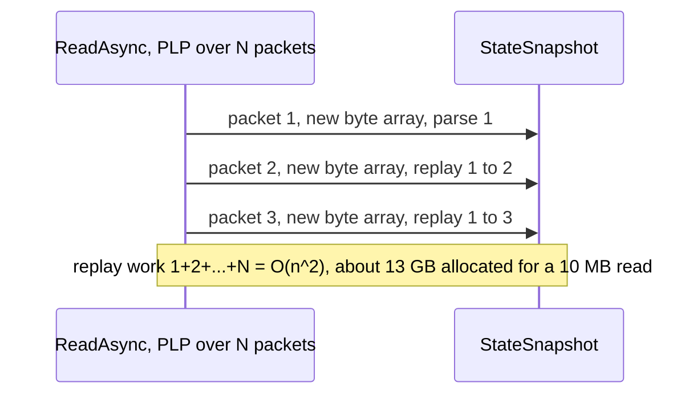

# CMD-1 — Pool snapshot packet buffers

| Field | Value |
| --- | --- |
| Area | Command execution |
| Issues | [#593](https://github.com/dotnet/SqlClient/issues/593), [#2408](https://github.com/dotnet/SqlClient/issues/2408) |
| Confidence | 0.74 |
| Blast / Test / Locality / Cohesion | L / H / H / H |
| Async-isolated | Y |
| Flag-gated | Y |

## Problem

The async read snapshot/replay mechanism stores received packets in a `StateSnapshot` chain of
`PacketData` nodes, and each node allocates a fresh `new byte[read]` buffer. For multi-packet reads
this dominates GC pressure — issue #593 measured ~13 GB allocated to read a 10 MB value. The buffers
are never returned, so the snapshot chain is a pure allocation sink.

## Bottleneck visualization

## Where it lives

- `TdsParserStateObject.cs` — `StateSnapshot` / `PacketData` (around lines 4655+), the per-packet
  buffer allocation, and the snapshot clear/reset path (graphify hub: `TdsParserStateObject`,
  155 edges).

## Proposed change

Rent the per-packet buffers from `ArrayPool<byte>.Shared` when appending to the snapshot chain, and
return them when the snapshot is cleared/reset (read completed or replay finished). Track rented
buffers so every rent has exactly one return. This is a contained lifetime: rent on append, return
on snapshot teardown.

## Criteria rationale

- **Blast radius (L)** — internal to the snapshot data structure; no API or protocol change.
- **Testability (H)** — deterministic to unit test with a custom `ArrayPool` that counts
  rent/return.
- **Locality / Cohesion (H)** — one class, one concern (snapshot buffer lifetime).

## Unit test outline

1. Inject a counting `ArrayPool<byte>`; drive a multi-packet snapshot and assert
   `rentCount == returnCount` after the read completes (no leaks, no double-return).
2. Assert replay reads identical bytes whether buffers are pooled or freshly allocated.
3. Assert an aborted/attention-cancelled read still returns all rented buffers.

## Risks and caveats

- Buffer lifetime must outlive replay; returning too early corrupts a replayed read — the test in
  step 1 guards this.
- Coordinate with the continuation-mode work (CMD-4): the multiplexer path also manages packet
  buffers.

## References

- [02-tds-async-reads summary](../../01-initial/02-tds-async-reads/summary.md)
- [05-allocation-reduction summary](../../01-initial/05-allocation-reduction/summary.md)
- [Quick-wins index](../README.md)
