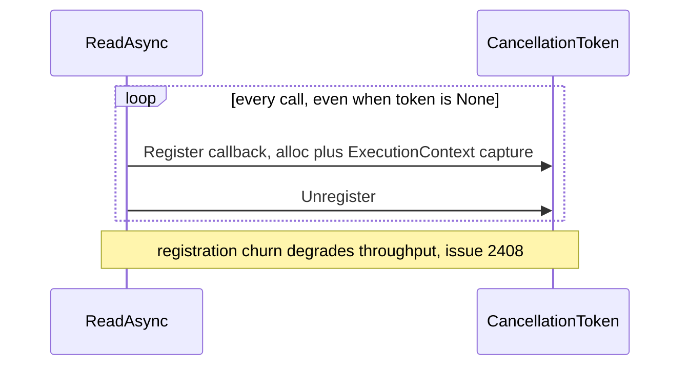

# CMD-2 — Optimize `CancellationToken` handling in `ReadAsync`

| Field | Value |
| --- | --- |
| Area | Command execution |
| Issues | [#2408](https://github.com/dotnet/SqlClient/issues/2408) |
| Confidence | 0.68 |
| Blast / Test / Locality / Cohesion | L / H / H / H |
| Async-isolated | Y |
| Flag-gated | Opt |

## Problem

`ReadAsync(cancellationToken)` registers a cancellation callback on every call. Issue #2408 shows
that passing a real `CancellationTokenSource` (vs `CancellationToken.None`) measurably degrades
throughput because of per-call registration/unregistration churn and the associated allocation.

## Bottleneck visualization

## Where it lives

- `SqlDataReader.cs` and `SqlCommand.Reader.cs` — the async read entry points where the token is
  registered (graphify hub: `SqlDataReader`, 209 edges).

## Proposed change

Three independent micro-optimizations:

1. **Skip registration when the token cannot cancel** — if `!cancellationToken.CanBeCanceled`, do
   not register at all.
2. **Use `UnsafeRegister`** where the captured `ExecutionContext` is not required, avoiding the
   context capture cost.
3. **Reuse a cached registration** across the multi-packet read instead of register/unregister per
   packet.

## Criteria rationale

- **Blast radius (L)** — additive guard clauses on the async read entry; default behaviour
  unchanged.
- **Testability (H)** — directly assertable with a fake token / registration counter.
- **Locality / Cohesion (H)** — confined to the reader async entry points.

## Unit test outline

1. With `CancellationToken.None`, assert no registration occurs (registration counter stays zero).
2. With a cancellable token, assert cancellation still aborts the read and surfaces
   `OperationCanceledException`.
3. Assert a single registration spans a multi-packet read rather than one-per-packet.

## Risks and caveats

- `UnsafeRegister` skips `ExecutionContext` flow — only apply where the callback does not depend on
  ambient context.
- Cancellation semantics (timing, exception type) must be byte-for-byte preserved.

## References

- [05-allocation-reduction summary](../../01-initial/05-allocation-reduction/summary.md)
- [Quick-wins index](../README.md)
