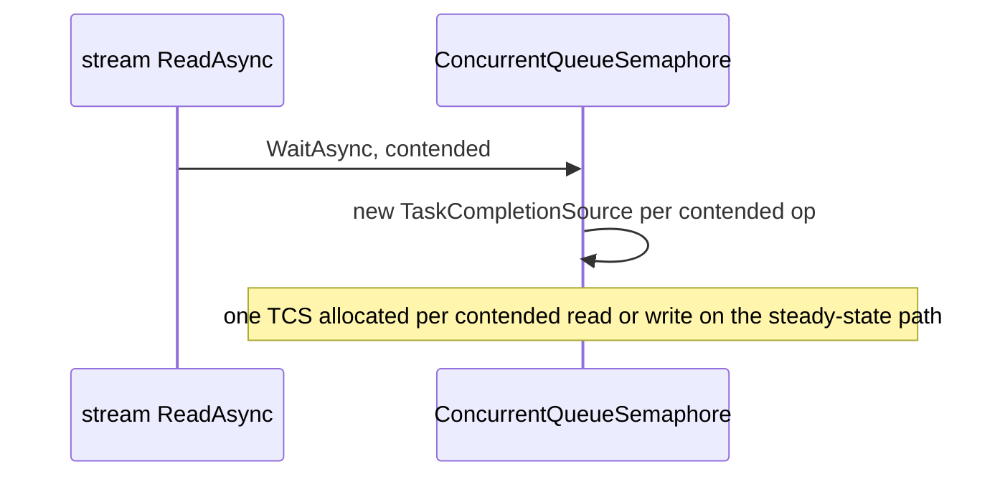

# CMD-3 — Remove per-op `TaskCompletionSource` in `ConcurrentQueueSemaphore`

| Field | Value |
| --- | --- |
| Area | Command execution |
| Issues | [#2418](https://github.com/dotnet/SqlClient/issues/2418) |
| Confidence | 0.60 |
| Blast / Test / Locality / Cohesion | M / M / H / H |
| Async-isolated | Y |
| Flag-gated | Y |

## Problem

Managed SNI guards every stream `ReadAsync` / `WriteAsync` with a `ConcurrentQueueSemaphore`, which
allocates a `TaskCompletionSource<bool>` for each contended wait. Graphify surfaced the hot edge
`SniSslStream → ConcurrentQueueSemaphore`, confirming this sits on the steady-state command read and
write path. The per-contended-op allocation adds GC pressure under concurrent command execution.

## Bottleneck visualization

## Where it lives

- `ManagedSni/ConcurrentQueueSemaphore.netcore.cs` — the semaphore + TCS-per-wait queue.
- `SniSslStream.netcore.cs` / `SniNetworkStream.netcore.cs` — `_readAsyncSemaphore` /
  `_writeAsyncSemaphore` fields wrapping all stream I/O.

## Proposed change

Replace the custom `ConcurrentQueueSemaphore` with `SemaphoreSlim(1, 1)` (whose `WaitAsync` is
allocation-light and already FIFO-fair for the single-permit case), or, if ordering guarantees must
be retained, pool the `TaskCompletionSource` instances instead of allocating per wait.

## Criteria rationale

- **Locality / Cohesion (H)** — one helper class plus its two stream consumers.
- **Blast radius (M)** — every managed-SNI stream read/write; concurrency-sensitive.
- **Testability (M)** — semaphore fairness/ordering tests need careful determinism.

## Unit test outline

1. Assert mutual exclusion: overlapping `ReadAsync` calls are serialized (no interleaved reads).
2. Assert FIFO ordering of waiters if the current `ConcurrentQueueSemaphore` guarantees it.
3. Allocation test: under contention, assert the replacement allocates no per-wait TCS (using an
   allocation probe or a pooled-TCS counter).

## Risks and caveats

- Verify whether any caller depends on strict FIFO ordering that `SemaphoreSlim` does not guarantee.
- Interacts with CE-5 (handle-level locking) and the MARS demuxer — validate against both
  `UseCompatibilityProcessSni` modes.

## References

- [06-packet-locking summary](../../01-initial/06-packet-locking/summary.md)
- [05-allocation-reduction summary](../../01-initial/05-allocation-reduction/summary.md)
- [Quick-wins index](../README.md)
