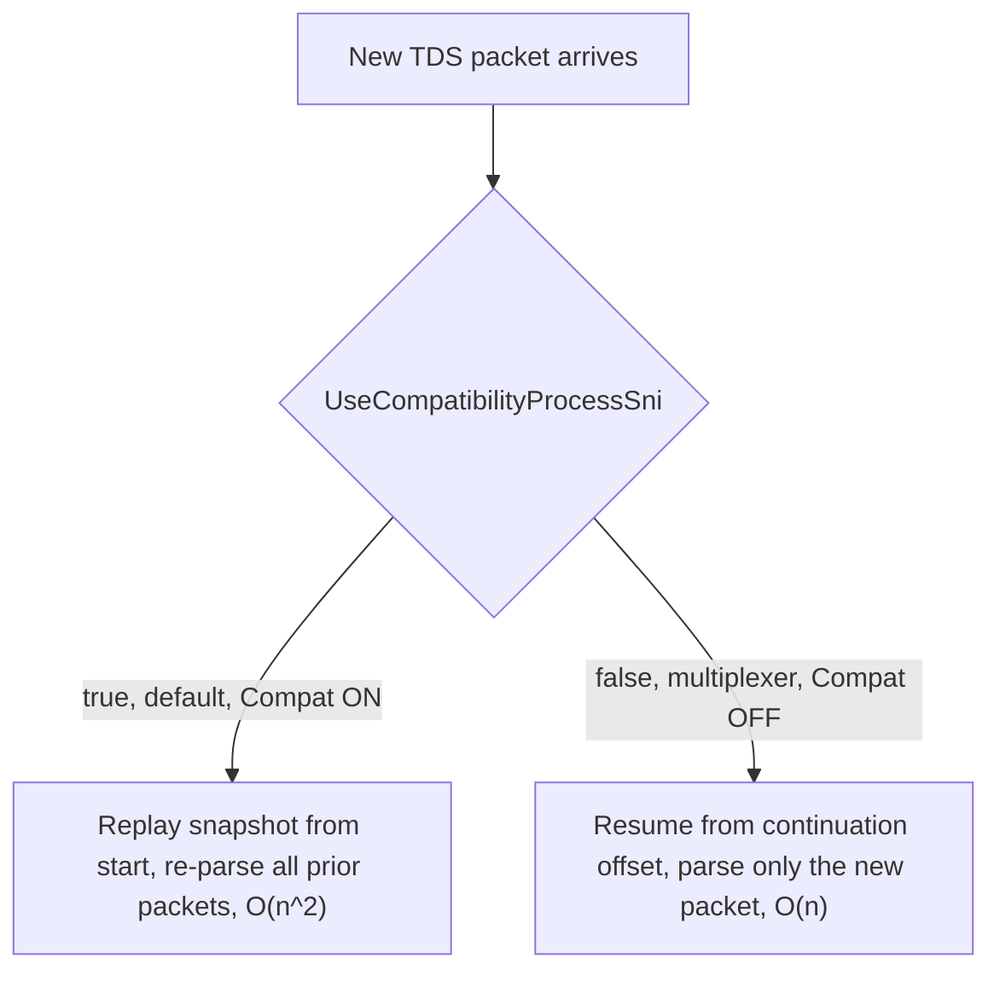

# CMD-4 — Expand continuation-mode coverage for PLP reads

| Field | Value |
| --- | --- |
| Area | Command execution |
| Issues | [#593](https://github.com/dotnet/SqlClient/issues/593), [#1562](https://github.com/dotnet/SqlClient/issues/1562) |
| Confidence | 0.68 |
| Blast / Test / Locality / Cohesion | H / M / M / H |
| Async-isolated | N |
| Flag-gated | Y |

## Problem

The default async read path replays the whole packet chain on each new packet — O(n²) in packet
count — causing the 250x slowdown on large async reads (#593). A continuation-based path that
resumes from the last offset already exists but is gated behind two experimental switches and may
not cover every multi-packet read operation.

## Bottleneck visualization

## Where it lives

- `TdsParserStateObject.cs` — `TryReadByteArrayWithContinue`, `TryReadStringWithContinue`,
  `TryReadPlpBytes` (continue offset tracking).
- `TdsParserStateObject.Multiplexer.cs` — the partial-packet reassembly path enabled by
  `UseCompatibilityProcessSni=false`.

## Proposed change

This is the **highest-impact, highest-blast** item — scoped here to incremental hardening rather
than a default flip:

1. **Audit** which PLP read operations are *not* covered by the existing `*WithContinue` paths.
2. **Add** continue-point coverage for the uncovered operations.
3. **Harden** the multiplexer's `AppendPacketData` assertions against connection-reset, MARS, and
   attention edge cases.
4. **Benchmark** against the #593 10 MB / 20 MB scenarios to confirm O(n²) elimination.
5. **Stage** a phased rollout (opt-in switch → default → remove compat path) separately.

## Criteria rationale

- **Cohesion (H)** — all within the snapshot/continuation/multiplexer subsystem.
- **Locality (M)** — spans the state object and the multiplexer file.
- **Blast radius (H)** — changes the steady-state packet path for **all** async reads; the reason it
  is ranked mid-list despite top raw impact.
- **Testability (M)** — needs multi-packet PLP fixtures and careful edge-case coverage.

## Unit test outline

1. For each PLP read op, feed an N-packet value and assert total parse work is O(n), not O(n²)
   (count re-parses).
2. Assert byte-for-byte equality between compat and continuation paths for the same input.
3. Edge cases: attention signal mid-read, connection reset mid-read, MARS-interleaved sessions.

## Risks and caveats

- Largest blast radius of any item here; gate behind the existing switches until benchmarks and edge
  cases are proven.
- The graphify call graph under-represents this area (it dropped `TryReadNetworkPacket`); rely on a
  Roslyn pass and the 01-initial anchors.

## References

- [02-tds-async-reads summary](../../01-initial/02-tds-async-reads/summary.md)
- [appcontext-switches analysis](../../01-initial/appcontext-switches.md)
- [Quick-wins index](../README.md)
