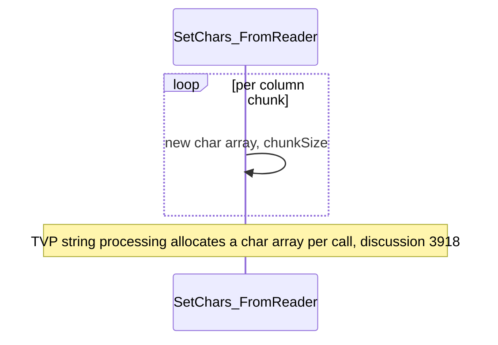

# CMD-5 — Pool `char[]` in `SetChars_FromReader`

| Field | Value |
| --- | --- |
| Area | Command execution |
| Issues | [Discussion #3918](https://github.com/dotnet/SqlClient/discussions/3918) |
| Confidence | 0.66 |
| Blast / Test / Locality / Cohesion | L / H / H / H |
| Async-isolated | N |
| Flag-gated | Opt |

## Problem

During TVP string processing, `ValueUtilsSmi.SetChars_FromReader` allocates a fresh `new char[...]`
chunk buffer on every call. For wide TVPs or many rows this is a steady stream of short-lived
allocations that adds GC pressure to the command-execution path. The 03-roslyn pass confirmed a
sibling `SetChars_FromRecord` with the identical `new char[]` pattern, so both TVP paths share the
problem and should be pooled together.

## Bottleneck visualization

## Where it lives

- `ValueUtilsSmi.SetChars_FromReader` (`ValueUtilsSmi.cs:2415`) — the per-column chunk buffer
  allocation.
- `ValueUtilsSmi.SetChars_FromRecord` (`ValueUtilsSmi.cs:2352`) — the sibling TVP path with the
  same `new char[]` allocation (confirmed by 03-roslyn).

## Proposed change

Rent the chunk buffer from `ArrayPool<char>.Shared` and return it in a `finally` after the column is
written, in **both** `SetChars_FromReader` and `SetChars_FromRecord`. The lifetime is strictly local
to each method call, so the rent/return pairing is trivial and leak-free.

## Criteria rationale

- **Blast radius (L)** — one method; behaviour identical, only allocation source changes.
- **Testability (H)** — inject a counting `ArrayPool<char>` and assert balanced rent/return.
- **Locality / Cohesion (H)** — a single self-contained method.

## Unit test outline

1. With a counting `ArrayPool<char>`, write a multi-chunk string column and assert
   `rentCount == returnCount`.
2. Assert the written characters are identical to the pre-change (freshly allocated) output.
3. Assert an exception mid-write still returns the rented buffer (the `finally` path).

## Risks and caveats

- Narrow audience (TVP streaming), so the absolute win is smaller than the broad items.
- Ensure the rented buffer length is honoured (rented arrays may be larger than requested — slice to
  the needed length).

## References

- [05-allocation-reduction summary](../../01-initial/05-allocation-reduction/summary.md)
- [Quick-wins index](../README.md)
