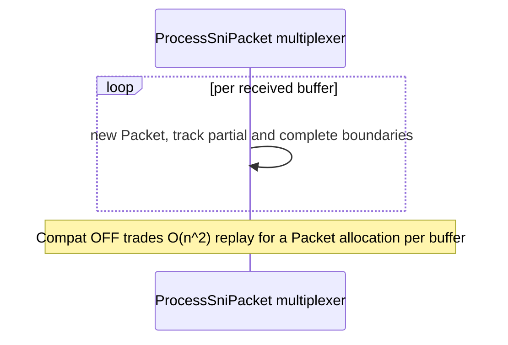

# CMD-6 — Pool multiplexer `Packet` objects (Compat OFF only)

| Field | Value |
| --- | --- |
| Area | Command execution (applies only when `UseCompatibilityProcessSni=false`) |
| Issues | [#593](https://github.com/dotnet/SqlClient/issues/593), [#1562](https://github.com/dotnet/SqlClient/issues/1562) |
| Confidence | 0.65 |
| Blast / Test / Locality / Cohesion | L / H / H / H |
| Async-isolated | N |
| Flag-gated | Y (inherently gated by `UseCompatibilityProcessSni=false`) |

## Problem

When the new packet multiplexer is active (`UseCompatibilityProcessSni=false`), `ProcessSniPacket`
allocates a `Packet` tracking object per received buffer to manage partial-packet reassembly and
multi-packet splitting. This is the price the multiplexer pays to eliminate the O(n²) snapshot
replay — but it makes `Packet` allocation the new steady-state allocator on the read path. It is the
natural successor to CMD-1 (snapshot buffer pooling), whose payoff shrinks once continuation stops
retaining the full packet chain.

## Bottleneck visualization

## Where it lives

- `TdsParserStateObject.Multiplexer.cs` — the multiplexer path in `ProcessSniPacket`, `_partialPacket`
  state, and `Packet` object creation / boundary tracking.

## Proposed change

Pool the `Packet` tracking objects (and any backing buffers they own) with an object pool or
`ArrayPool`, renting on receive and returning once the packet has been consumed by the snapshot /
reader. Lifetime is bounded by packet consumption, so rent↔return pairing is local.

## Criteria rationale

- **Blast radius (L)** — only the multiplexer path, which is already opt-in via the switch.
- **Testability (H)** — inject a counting pool and assert balanced rent/return across multi-packet
  reads.
- **Locality / Cohesion (H)** — confined to `Multiplexer.cs` and its packet lifecycle.

## Unit test outline

1. With a counting pool, drive a multi-packet read through the multiplexer and assert
   `rentCount == returnCount` (no leaks, no double-return).
2. Assert byte-for-byte read equality versus the non-pooled multiplexer output.
3. Edge cases: partial packet split across buffers, attention mid-read, connection reset — all
   return their rented `Packet` objects.

## Risks and caveats

- **Compat-OFF only** — delivers nothing until the multiplexer is the active path; sequence after or
  alongside CMD-4 (continuation-mode graduation).
- `_partialPacket` lifetime spans receives; returning a `Packet` still referenced by partial state
  corrupts reassembly — the balance test in step 1 guards this.
- The stricter `AppendPacketData` assertions in the multiplexer must continue to hold with pooled
  objects.

## References

- [switch-contrast](switch-contrast.md)
- [02-tds-async-reads summary](../../01-initial/02-tds-async-reads/summary.md)
- [Quick-wins index](../README.md)
