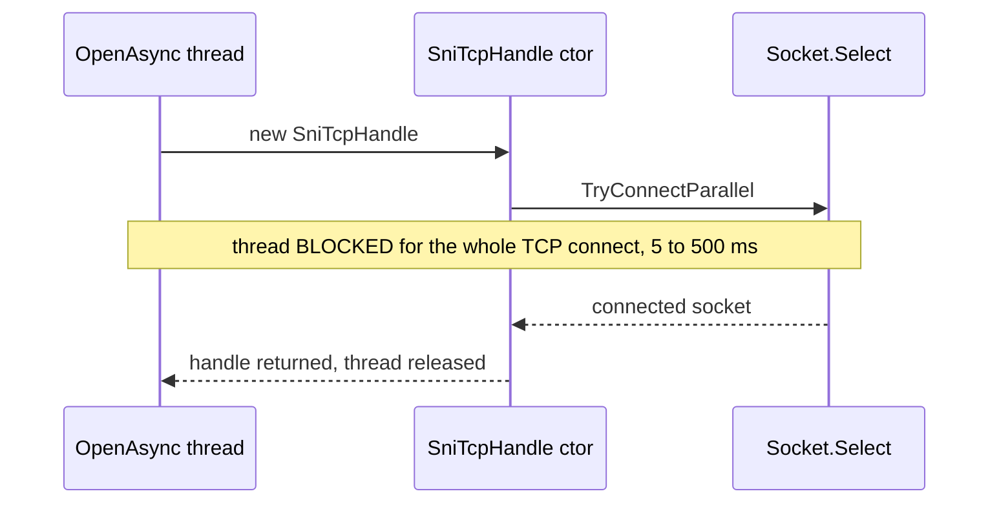

# CE-1 — Async managed-SNI TCP connect

| Field | Value |
| --- | --- |
| Area | Connection establishment |
| Issues | [#979](https://github.com/dotnet/SqlClient/issues/979), [#601](https://github.com/dotnet/SqlClient/issues/601), [#3118](https://github.com/dotnet/SqlClient/issues/3118) |
| Confidence | 0.78 |
| Blast / Test / Locality / Cohesion | M / M / H / H |
| Async-isolated | Y |
| Flag-gated | Y |

## Problem

`SniTcpHandle` establishes the TCP connection **synchronously** inside its constructor. On Unix
managed SNI the multi-endpoint path (`TryConnectParallel`) waits with `Socket.Select` / blocking
completion, so a thread is held for the full connect duration (typically 5–500 ms, longer on cloud
or failure). Under concurrent `OpenAsync` load these held threads are a primary thread-starvation
vector — the calling thread cannot service other async continuations while it blocks here.

## Bottleneck visualization

## Where it lives

- `ManagedSni/SniTcpHandle.netcore.cs` — constructor, `Connect()`, `TryConnectParallel()`
  (graphify hub: `SniTcpHandle`, 33 edges).
- Reached from `TdsParserStateObjectManaged.netcore.cs` → `CreatePhysicalSNIHandle()`.

## Proposed change

Add an async connect path (for example a static `SniTcpHandle.CreateAsync(...)` factory) that uses
`Socket.ConnectAsync`, and for multi-IP targets issues parallel `ConnectAsync` calls that complete
on the first success with cancellation of the rest. The thread is released during the `await`. Keep
the existing synchronous constructor for `Open()` so only the async path changes behaviour.

## Criteria rationale

- **Locality (H)** — confined to one managed-SNI file plus its single creation call site.
- **Cohesion (H)** — the change is entirely within TCP-connect establishment.
- **Blast radius (M)** — affects every managed-SNI async open (Unix, and managed-on-Windows).
- **Testability (M)** — requires a loopback socket harness but no live SQL Server.

## Unit test outline

1. With a `TcpListener` stub and `ThreadPool.SetMinThreads` constrained low, start N concurrent
   async connects and assert they do not serialize (completion time ≪ N × per-connect latency).
2. Assert connect timeout and `CancellationToken` cancellation are honoured.
3. For a multi-endpoint host, assert the first responsive endpoint wins and the others are cancelled.

## Risks and caveats

- Must preserve connect-timeout semantics and `MultiSubnetFailover` ordering.
- The connected socket feeds pre-login/login; ensure handoff is unchanged.
- Native SNI (Windows) has no async connect and is out of scope.

## References

- [04-async-sni-opens summary](../../01-initial/04-async-sni-opens/summary.md)
- [Quick-wins index](../README.md)
