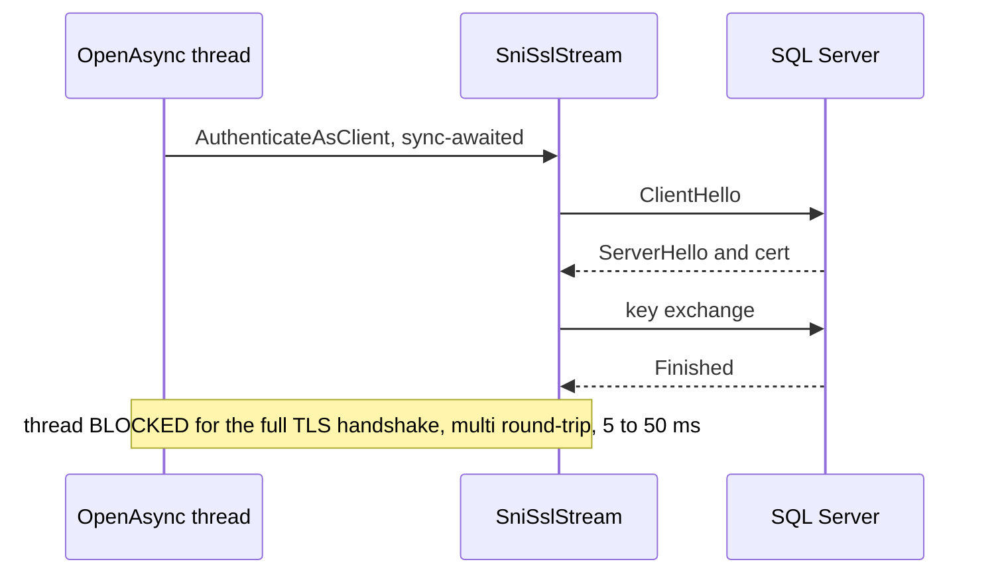

# CE-2 — Async TLS handshake on the open path

| Field | Value |
| --- | --- |
| Area | Connection establishment |
| Issues | [#979](https://github.com/dotnet/SqlClient/issues/979) |
| Confidence | 0.72 |
| Blast / Test / Locality / Cohesion | L / M / H / H |
| Async-isolated | Y |
| Flag-gated | Y |

## Problem

During `OpenAsync`, the TLS handshake on the managed SNI stream is driven synchronously (the
`AuthenticateAsClient` call, or an `AuthenticateAsClientAsync` that is awaited synchronously). The
handshake is a multi-round-trip exchange (~5–50 ms, more under latency), and blocking the calling
thread for its duration adds to the open-path starvation alongside the TCP connect.

## Bottleneck visualization

## Where it lives

- `ManagedSni/SniSslStream.netcore.cs` and `SslOverTdsStream` (graphify hub: `SslOverTdsStream`,
  16 edges; surprising edge `SniSslStream → ConcurrentQueueSemaphore`).
- The synchronous `AuthenticateAsClient` is invoked from **both** `SniTcpHandle.EnableSsl`
  (`SniTcpHandle.netcore.cs:735,739`) and `SniNpHandle.EnableSsl` (`SniNpHandle.netcore.cs:338,343`)
  — confirmed by 03-roslyn. The named-pipe handle shares the pattern and must be converted too.
- Invoked from the pre-login encryption negotiation in `TdsParser`.

## Proposed change

Use `SslStream.AuthenticateAsClientAsync` with a true `await` on the async open path so the thread
is released during the handshake, in both the TCP and named-pipe `EnableSsl` paths. Preserve the
synchronous handshake for the synchronous `Open()` path. No protocol changes — only the awaiting
behaviour differs.

## Criteria rationale

- **Blast radius (L)** — only the async-open TLS path; sync `Open()` unchanged.
- **Locality / Cohesion (H)** — one stream class, one logical step (handshake).
- **Testability (M)** — needs a TLS loopback (self-signed cert) harness, no SQL Server.

## Unit test outline

1. Stand up a loopback `SslStream` server with a self-signed cert; assert the client handshake
   completes asynchronously without blocking the calling thread (constrained thread pool).
2. Assert handshake failures (bad cert, protocol mismatch) surface the same exception type as today.
3. Assert `Encrypt=Strict` / TDS 8.0 first-handshake ordering is preserved.

## Risks and caveats

- Certificate validation callbacks and `TrustServerCertificate` behaviour must be byte-for-byte
  preserved.
- Interaction with the `ConcurrentQueueSemaphore` read/write locks on the same stream (see CMD-3).

## References

- [04-async-sni-opens summary](../../01-initial/04-async-sni-opens/summary.md)
- [Quick-wins index](../README.md)
