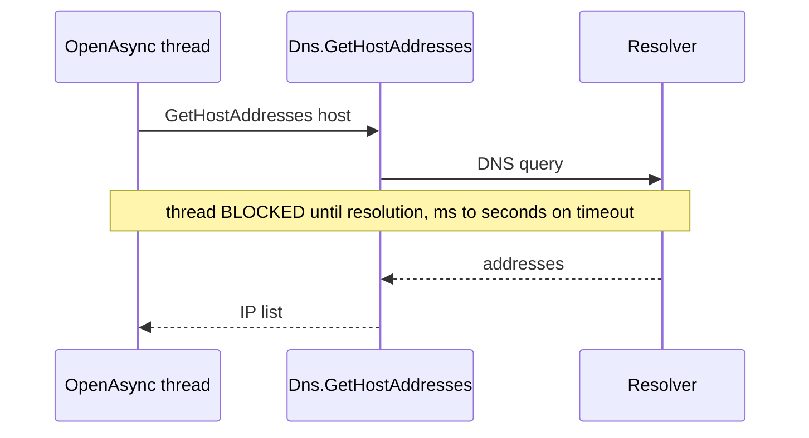

# CE-3 — Async DNS resolution

| Field | Value |
| --- | --- |
| Area | Connection establishment |
| Issues | [#979](https://github.com/dotnet/SqlClient/issues/979), [#601](https://github.com/dotnet/SqlClient/issues/601) |
| Confidence | 0.66 |
| Blast / Test / Locality / Cohesion | L / H / H / H |
| Async-isolated | Y |
| Flag-gated | Y |

## Problem

The managed-SNI connect helper resolves the host with a blocking `Dns.GetHostAddresses` call before
connecting. DNS lookups can take from milliseconds to seconds (timeouts, slow resolvers), and the
blocking call holds the calling thread for the entire resolution — an avoidable starvation
contribution on the async open path.

## Bottleneck visualization

## Where it lives

- `ManagedSni/SniTcpHandle.netcore.cs` — host resolution prior to `Socket.ConnectAsync`.

## Proposed change

Replace `Dns.GetHostAddresses(host)` with `await Dns.GetHostAddressesAsync(host, cancellationToken)`
on the async open path. Pairs naturally with CE-1 (async TCP connect) since both live in the same
helper. Keep the synchronous lookup for the synchronous `Open()` path.

## Criteria rationale

- **Blast radius (L)** — a single call swap on the async path.
- **Testability (H)** — easily unit-testable by injecting a resolver delegate / using a known host.
- **Locality / Cohesion (H)** — one helper, one concern (name resolution).

## Unit test outline

1. Inject a slow/awaitable resolver and assert the calling thread is not blocked during resolution.
2. Assert `CancellationToken` cancels an in-flight lookup and surfaces the expected timeout error.
3. Assert IPv4/IPv6 ordering and `MultiSubnetFailover` address handling are unchanged.

## Risks and caveats

- Resolver injection may require a small seam if the call is currently static; keep it internal.
- Must preserve existing address-family selection and DNS-caching behaviour.

## References

- [04-async-sni-opens summary](../../01-initial/04-async-sni-opens/summary.md)
- [Quick-wins index](../README.md)
