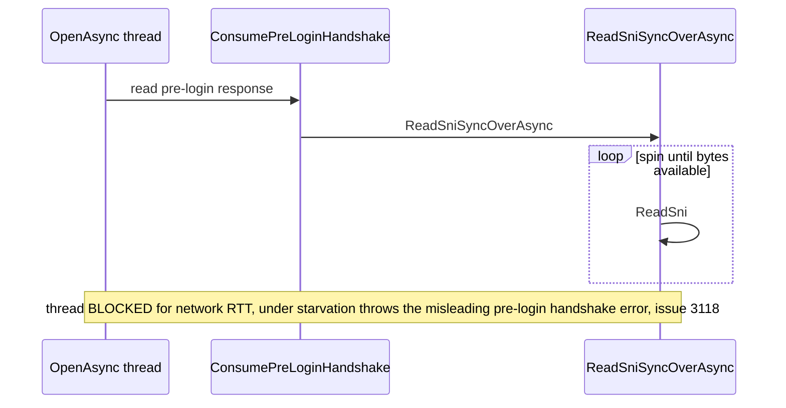

# CE-4 — Async pre-login read

| Field | Value |
| --- | --- |
| Area | Connection establishment |
| Issues | [#3118](https://github.com/dotnet/SqlClient/issues/3118), [#1530](https://github.com/dotnet/SqlClient/issues/1530) |
| Confidence | 0.60 |
| Blast / Test / Locality / Cohesion | M / M / M / H |
| Async-isolated | Y |
| Flag-gated | Y |

## Problem

`ConsumePreLoginHandshake` reads the server's pre-login response with `ReadSniSyncOverAsync`, a
blocking sync-over-async read. Under thread-pool starvation this read fails and surfaces the
misleading "pre-login handshake" error (issue #3118) even though the real cause is thread
exhaustion. Blocking here also holds a thread during the round trip.

## Bottleneck visualization

## Where it lives

- `TdsParser.cs` — `SendPreLoginHandshake` / `ConsumePreLoginHandshake`.
- `TdsParserStateObject.cs` — `ReadSniSyncOverAsync` (internal) and the network read it wraps.

## Proposed change

On the async open path, read the pre-login response with the genuinely asynchronous read primitive
(awaiting the pended packet) instead of `ReadSniSyncOverAsync`. The pre-login payload is small and
single-packet in the common case, so the change is contained. Preserve the synchronous path for
`Open()`.

## Criteria rationale

- **Cohesion (H)** — one protocol step (pre-login consume).
- **Locality (M)** — touches `TdsParser` and the state-object read helper.
- **Blast radius (M)** — affects all async opens; pre-login runs on every connection.
- **Testability (M)** — needs a TDS pre-login byte-stream fixture (no live server).

## Unit test outline

1. Feed a canned pre-login response through a fake state object and assert it parses without a
   blocking read (verify no `ReadSniSyncOverAsync` on the async path).
2. Simulate a split pre-login packet and assert the async path awaits and resumes correctly.
3. Under a constrained thread pool, assert concurrent pre-logins do not deadlock or raise the
   spurious handshake error.

## Risks and caveats

- Pre-login negotiates encryption; ordering relative to the TLS handshake (CE-2) must be preserved.
- Multi-packet pre-login (rare) must be handled by the async path.

## References

- [04-async-sni-opens summary](../../01-initial/04-async-sni-opens/summary.md)
- [Quick-wins index](../README.md)
