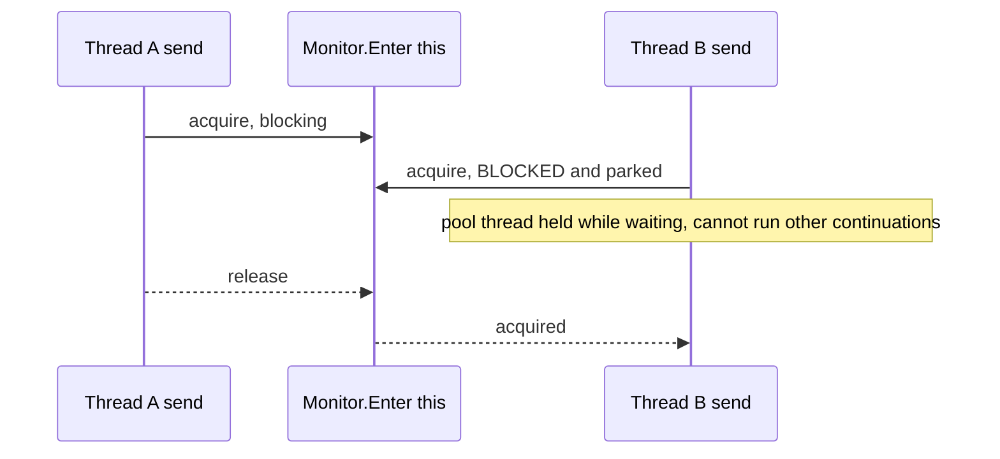

# CE-5 — `SemaphoreSlim` for `SniTcpHandle` connection locks

| Field | Value |
| --- | --- |
| Area | Connection establishment |
| Issues | [#2418](https://github.com/dotnet/SqlClient/issues/2418), [#1530](https://github.com/dotnet/SqlClient/issues/1530) |
| Confidence | 0.50 |
| Blast / Test / Locality / Cohesion | M / M / H / M |
| Async-isolated | N |
| Flag-gated | Y |

## Problem

`SniTcpHandle.Send` uses `Monitor.Enter(this)` plus `lock(_sendSync)` — blocking locks. During the
login phase (and steady state), holding a blocking monitor while I/O is in flight ties up thread
pool threads that could otherwise run async continuations, compounding starvation under concurrent
opens.

## Bottleneck visualization

## Where it lives

- `ManagedSni/SniTcpHandle.netcore.cs` — the 03-roslyn pass found the same gate guarding three
  members, so a `SemaphoreSlim` swap must convert all of them together:
  - `Send()` — a `Monitor.TryEnter` / `Monitor.Enter` / `Monitor.Exit` triple (`:824,828,864`)
    **plus** a `lock` block (`:835`).
  - `Receive()` — `lock(this)` (`:883`).
  - `Dispose()` — `lock(this)` (`:54`).

## Proposed change

Replace the blocking monitors with a `SemaphoreSlim(1, 1)` acquired via `WaitAsync` on async paths
(and `Wait` on sync paths), giving an async-friendly mutual-exclusion primitive, across `Send`,
`Receive`, **and** `Dispose` (they share the gate). Keep the non-blocking attention behaviour
(`TryEnter` → `Wait(0)`).

## Criteria rationale

- **Locality (H)** — one handle class.
- **Cohesion (M)** — touches both send and receive locking plus the attention fast-path.
- **Blast radius (M)** — every managed-SNI send/receive; the most concurrency-sensitive area.
- **Testability (M)** — concurrency tests are inherently trickier to make deterministic.

## Unit test outline

1. Assert mutual exclusion: concurrent `SendAsync` calls do not interleave packet writes.
2. Assert the attention (out-of-band) path still acquires non-blocking and never deadlocks against
   an in-flight send.
3. Stress test: many concurrent send/receive operations complete without deadlock and without
   serializing onto a single thread.

## Risks and caveats

- **Highest-risk item in this list.** A prior MARS locking rewrite (PR #1357) was merged then
  reverted; this area is unforgiving.
- Must be validated against both `UseCompatibilityProcessSni` modes (compat and multiplexer paths).
- Sequence after, or carefully alongside, the MARS demuxer locking if that is also changed.

## References

- [06-packet-locking summary](../../01-initial/06-packet-locking/summary.md)
- [Quick-wins index](../README.md)
