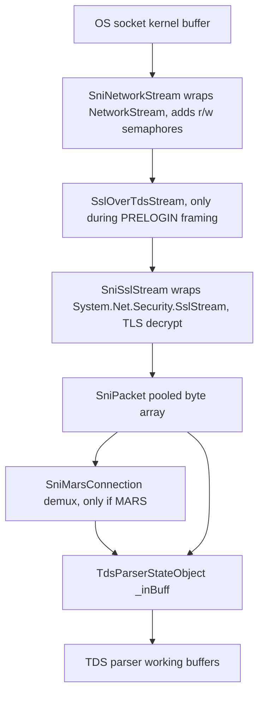

# 01 — Managed SNI: abstraction value, copies, zero-copy, and data access

**Date**: 2026-06-29
**Scope**: The managed SNI layer and the TDS read/data path on .NET (Unix and managed-on-Windows)
**Method**: Source-level investigation of `ManagedSni/*`, `TdsParserStateObject.cs`, `Packet.cs`,
`SqlDataReader.cs`, and `SqlCommand.*`. Paths/lines below are relative to
`src/Microsoft.Data.SqlClient/src/Microsoft/Data/SqlClient/`.

---

## Questions addressed

1. What is the managed SNI layer actually buying us — multiple transports, or just TCP wrapped in
   abstractions?
2. Is it reading the TCP socket "properly" (modern, low-level, low-copy)?
3. Is there a layer that reads packets off the wire and passes them up?
4. Can C# reinterpret a pooled block of memory as a struct without copying (C-style overlay)?
5. Are we making more copies than necessary because of the abstraction layers?
6. Does the managed path need SNI at all?
7. Can apps ask for data other than "buffer it all" — streaming vs chunking?
8. What forms of `ExecuteReader` exist?

---

## TL;DR

- Managed SNI abstracts only **two transports**: TCP (`SniTcpHandle`) and Named Pipes
  (`SniNpHandle`). Shared Memory is **not** implemented. So it is effectively "TCP plus niche Named
  Pipes," not a rich multi-transport layer.
- The abstraction's real value is **MARS multiplexing** and **TLS-over-TDS framing**
  (`SslOverTdsStream`) — not transport multiplicity.
- The read path makes **at least three explicit user-mode copies per packet**; two of them exist
  purely because of the `SniPacket` buffer-handoff layer.
- **No zero-copy / reinterpret techniques are used.** The TDS header is parsed by manual byte
  shifting; there is no `MemoryMarshal`, `Unsafe.As`, or `ref struct` overlay. `Span<T>` appears
  only as a vehicle for `CopyTo`.
- Async reads use the **legacy** `Stream.ReadAsync(byte[], int, int, CancellationToken)` overload,
  not the modern `Stream.ReadAsync(Memory<byte>, CancellationToken)`.
- Streaming exists but is **opt-in**: `SequentialAccess` plus `GetStream`/`GetTextReader`/`GetBytes`/
  `GetChars`/`GetFieldValue<Stream>`. The default buffers each column whole, and value-type async
  access still buffers.

---

## 1. What does managed SNI actually abstract?

`SniProxy` defines the protocol set (`SniProxy.netcore.cs:343`):

```text
internal enum Protocol { TCP, NP, None, Admin };
```

Routing (`SniProxy.netcore.cs:80-100`) sends `None`/`TCP`/`Admin` to `CreateTcpHandle` and `NP` to
`CreateNpHandle`; anything else hits `Debug.Fail("Unexpected connection protocol")`. There is **no
Shared Memory (`lpc:`)** path — it returns `ProtocolNotSupportedError` (`SniCommon.netcore.cs:24`).

So the answer to "multiple transports or just TCP": **TCP plus Named Pipes**, where Named Pipes is a
Windows-mostly, niche transport. On Unix it is TCP only. The layer also owns SSRP instance discovery
(`SsrpClient.netcore.cs`) and SPN computation (`SniProxy.netcore.cs:115-180`), but those are
connection-setup concerns, not steady-state transport.

**Verdict:** the breadth of transports does **not** justify the abstraction. What justifies a layer
is MARS and TLS-over-TDS framing (sections 2 and 6).

---

## 2. The layer stack

A received, encrypted TDS packet traverses this stack (`SniTcpHandle.netcore.cs:260-275`):



Class hierarchy: `SniHandle` (abstract) → `SniPhysicalHandle` (adds an `ObjectPool<SniPacket>`) →
`SniTcpHandle` / `SniNpHandle`. MARS layers `SniMarsConnection` (demux, `Dictionary<int,
SniMarsHandle>`) over the physical handle, with `SniMarsHandle` per session.

---

## 3. Is it reading the TCP socket "properly"?

Partly. `SniTcpHandle` does **not** touch the raw `Socket` for reads — it wraps it in
`SniNetworkStream` (a `NetworkStream` subclass that adds read/write semaphores) and reads through the
stream. Reads land in a pooled `SniPacket` buffer via:

```text
SniPacket.ReadFromStream  (SniPacket.netcore.cs:255)
    _dataLength = stream.Read(_data, _headerLength, _dataCapacity);   // byte[] + offset + count
```

The async path (`SniPacket.netcore.cs:267`) uses the **legacy** overload:

```text
stream.ReadAsync(_data, 0, _dataCapacity, CancellationToken.None).ContinueWith(...)
```

This is the `byte[]`-based `ReadAsync`, not `ReadAsync(Memory<byte>, CancellationToken)`. It also
pairs the read with a `ContinueWith` continuation (extra Task allocation) instead of `await`. So:
there **is** a layer responsible for reading packets off the wire (`SniTcpHandle` →
`SniPacket.ReadFromStream(Async)`), but it uses pre-`Memory<T>`-era APIs.

---

## 4. The copy chain — are we copying more than necessary?

Yes. Tracing one received packet to the parser:

| # | Copy | Where | SNI-induced? |
| --- | --- | --- | --- |
| 0 | kernel TLS record → `SslStream` plaintext buffer | inside `System.Net.Security` | No (BCL) |
| 1 | stream → `SniPacket._data` | `SniPacket.ReadFromStream` (`SniPacket.netcore.cs:256`) | the actual OS read |
| 2 | demux packet → per-session `SniPacket` (MARS only) | `SniPacket.TakeData` → `Buffer.BlockCopy` (`SniPacket.netcore.cs:238-245`) | **Yes** |
| 3 | `SniPacket` → `TdsParserStateObject._inBuff` | `SniPacket.GetData` → `Buffer.BlockCopy` (`SniPacket.netcore.cs:227-232`, via `TdsParserStateObjectManaged.netcore.cs:69-75`) | **Yes** |
| 4 | `_inBuff` → consumer buffer | `TryReadByteArray` → `Span.CopyTo` (`TdsParserStateObject.cs:1667-1671`) | partly |

Copy #3 (`SniPacket.GetData` → `_inBuff`) exists **only** because the data was first staged in a
`SniPacket`. Copy #2 is an additional MARS-path `Buffer.BlockCopy`. A design that read directly into
`_inBuff` (or passed a `Span<byte>` view) would remove copy #3 entirely for the non-MARS path — the
common case.

---

## 5. Reinterpreting memory without copying

**Yes, C# can overlay memory like C** — and the code does **not** use it. The toolbox:

- `Span<T>` / `ReadOnlySpan<T>` — a view over memory with no copy.
- `MemoryMarshal.Read<T>(span)` / `MemoryMarshal.AsRef<T>(span)` — reinterpret a byte span **as** a
  struct `T` (the C "overlay this memory as a struct" pattern) with no copy.
- `MemoryMarshal.Cast<TFrom, TTo>(span)` — reinterpret a span of one element type as another.
- `System.Runtime.CompilerServices.Unsafe.As<TFrom, TTo>` / `Unsafe.ReadUnaligned<T>` — raw
  reinterpret.
- `ref struct` + `[StructLayout(LayoutKind.Sequential, Pack = 1)]` — a header struct mapped directly
  over the buffer.
- `BinaryPrimitives.ReadUInt16BigEndian(span)` — endian-correct field reads with no allocation.
- `stackalloc` — stack buffers with no heap allocation.

What the code actually does:

- **TDS packet header** is parsed by **manual byte shifting** (`Packet.cs:144-158`), e.g.
  `header[offset] << 8 | header[offset+1]` — correct, but neither `BinaryPrimitives` nor a struct
  overlay.
- **SMUX header** uses `BinaryPrimitives` (`SniSmuxHeader.netcore.cs:20-32`) but still copies each
  field into struct members — not a zero-copy overlay.
- `Span`/`ReadOnlySpan` are used widely, but always terminated by `CopyTo` / `Buffer.BlockCopy`.
- **No** `MemoryMarshal.Read`/`AsRef`, `Unsafe.As`, or `ref struct` header overlay anywhere on the
  read path.

**Opportunity:** parse the 8-byte TDS header and the 16-byte SMUX header via a `ref struct` overlaid
on the buffer with `MemoryMarshal.AsRef<T>` (or `BinaryPrimitives` over a `ReadOnlySpan<byte>`),
reading fields in place without staging into `SniPacket` and without field-by-field copies.

---

## 6. Does the managed path need SNI at all?

It needs *some* of it. Splitting load-bearing from incidental:

| Responsibility | Load-bearing? | Note |
| --- | --- | --- |
| MARS multiplexing (`SniMarsConnection`, ~360 LOC demux) | **Yes** | Multiple TDS streams over one socket; genuinely valuable |
| TLS-over-TDS PRELOGIN framing (`SslOverTdsStream`) | **Yes** | MS-TDS requires PRELOGIN inside TDS frames |
| Protocol selection TCP vs Named Pipes | Marginal | Only two transports; one on Unix |
| SSRP instance discovery, SPN, multi-subnet failover | Yes (setup) | Connection establishment, not steady state |
| `SniPacket` pooling + handoff | **Incidental** | Adds copies #2/#3; pooling could live in the parser |
| `SniNetworkStream` thin wrapper | Incidental | Only adds r/w semaphores; could be folded in |
| Virtual `Send`/`Receive`/`ReceiveAsync` dispatch | Incidental | Protocol is fixed at connect; virtual dispatch on the I/O hot path |

**A "thin reader" is feasible for the common case** (TCP, no MARS): read directly from the
`SslStream`/`NetworkStream` into `_inBuff` (or hand up a `Span<byte>`), form TDS packets, and pass
them to the parser — dropping the `SniPacket` staging copy and the virtual handle dispatch. MARS and
TLS framing would still need a (smaller) multiplexing/framing layer, so SNI does not vanish — but the
steady-state single-stream path could shed most of its indirection.

---

## 7. Streaming vs buffering — how can an app ask for data?

By **default the reader buffers each accessed column whole** (`ReadColumn` → `TryReadColumn` fills
`_data[]`). PLP/`MAX` values are read fully into memory unless the caller opts into streaming.

`CommandBehavior.SequentialAccess` switches to forward-only, on-demand access and unlocks the
streaming APIs:

| API | Streams (with `SequentialAccess`) | Async streaming | Notes |
| --- | --- | --- | --- |
| `GetStream(i)` (`SqlDataReader.cs:1532`) | Yes → `SqlSequentialStream` | sync only | else buffers into `MemoryStream` |
| `GetTextReader(i)` (`SqlDataReader.cs:1956`) | Yes → `SqlSequentialTextReader` | sync only | else buffers into `StringReader` |
| `GetBytes(i, off, ...)` (`SqlDataReader.cs:1620`) | Yes, chunked, offset-based | sync only | forward-only |
| `GetChars(i, off, ...)` (`SqlDataReader.cs:2040`) | Yes, chunked, offset-based | sync only | forward-only |
| `GetFieldValue<Stream/TextReader/XmlReader>` (`SqlDataReader.cs:2673`) | Yes | — | streaming wrappers |
| `GetFieldValueAsync<Stream/TextReader/XmlReader>` (`SqlDataReader.cs:5132`) | Yes | **Yes** | the only true async streaming |
| `GetFieldValueAsync<T>` value types | No, buffers | Yes (buffered) | async but not streaming |

Streaming implementations: `SqlSequentialStream.cs` and `SqlSequentialTextReader.cs`, backed by
`TryReadPlpBytes` / `ReadPlpUnicodeChars` chunked reads.

**Caveats:** streaming is forward-only and column-order-constrained; value-type async access still
buffers; and Always Encrypted columns cannot be streamed. So the answer is: yes, callers can avoid
"buffer it all" — via `SequentialAccess` plus `GetStream`/`GetTextReader`/`GetBytes`/`GetChars` (and
`GetFieldValueAsync<Stream>` for true async streaming) — but it is opt-in and under-advertised.

---

## 8. Forms of `ExecuteReader` and command execution

| API | File | Notes |
| --- | --- | --- |
| `ExecuteReader()` / `ExecuteReader(CommandBehavior)` | `SqlCommand.Reader.cs:89,113` | sync; `RunBehavior.ReturnImmediately` |
| `ExecuteReaderAsync()` / `(CancellationToken)` / `(CommandBehavior)` / `(CommandBehavior, CancellationToken)` | `SqlCommand.Reader.cs:158-180` | modern async |
| `BeginExecuteReader(...)` / `EndExecuteReader(...)` | `SqlCommand.Reader.cs:31-84` | legacy APM |
| `ExecuteScalar()` / `ExecuteScalarAsync(...)` | `SqlCommand.Scalar.cs:23,75` | first column of first row |
| `ExecuteNonQuery()` / `ExecuteNonQueryAsync(...)` / `Begin`/`End` | `SqlCommand.NonQuery.cs:34-133` | `RunBehavior.UntilDone` |
| `ExecuteXmlReader()` / `ExecuteXmlReaderAsync(...)` / `Begin`/`End` | `SqlCommand.Xml.cs:28-136` | uses `SequentialAccess` internally for FOR XML |

Internals: `RunBehavior` (`TdsParserHelperClasses.cs:59-67`) — `UntilDone`, `ReturnImmediately`,
`Clean`, `Attention`. `CommandBehavior` flags that shape execution: `SequentialAccess`, `SingleRow`,
`SingleResult`, `SchemaOnly`, `KeyInfo`, `CloseConnection`.

Notably, `ExecuteXmlReader` already drives the **streaming** (`SequentialAccess`) path internally —
evidence that the streaming machinery is solid and could be the default for large-value scenarios.

---

## 9. Candidate fundamental-improvement directions

These are architectural (larger than the [04 quick wins](../04-quick-wins/README.md)), but several
decompose into low-risk steps. The exact read-path method and allocation anchors they touch are
confirmed in [03-roslyn](../03-roslyn/blocking-and-allocations.md):

1. **Modernize the socket read** — switch `SniPacket.ReadFromStreamAsync` to
   `Stream.ReadAsync(Memory<byte>, CancellationToken)` with `await` instead of the `byte[]` overload
   plus `ContinueWith`. Removes a Task allocation and enables `Memory`-based pooling.
2. **Collapse the `SniPacket` staging copy** — read directly into `_inBuff` (or pass a `Span<byte>`
   view) for the non-MARS path, eliminating copy #3 and, for MARS, reworking copy #2.
3. **Zero-copy header parsing** — overlay a `ref struct` (or use `BinaryPrimitives`/`MemoryMarshal`)
   on the TDS and SMUX headers instead of byte shifting / field copies.
4. **Thin single-stream reader** — for TCP without MARS, bypass most of the `SniHandle` virtual
   dispatch; keep a focused MARS/TLS-framing layer for the cases that need it.
5. **Make streaming the easy path** — the streaming stack (`SqlSequentialStream`,
   `SqlSequentialTextReader`, PLP chunking) already works and is used by `ExecuteXmlReader`; surface
   it better (docs/defaults) so large reads do not silently buffer gigabytes.

### Risk and confidence

Scored like the [04-quick-wins legend](../04-quick-wins/README.md#scoring-legend) — prefer low
**Blast**, high **Test / Locality / Cohesion**, plus **Async-isolated** and **Flag-gated**. Because
these are architectural, an **Effort** column (S/M/L) is added and confidences are lower than the
quick wins. Directions 1–4 are detailed with the same scoring in
[02-zero-copy-thin-reader](02-zero-copy-thin-reader.md#risk-and-confidence).

| Dir | Direction | Blast / Test / Locality / Cohesion | Async-isolated | Flag-gated | Effort | Confidence |
| --- | --- | --- | --- | --- | --- | --- |
| 1 | Memory-based socket reads | M / H / H / H | Y | Opt | S | 0.70 |
| 2 | Collapse `SniPacket` staging copy | H / M / M / M | N | Y | M | 0.55 |
| 3 | In-place header overlay | L / H / H / H | N | Opt | S | 0.72 |
| 4 | Thin single-stream reader | H / M / L / M | N | Y | L | 0.45 |
| 5 | Make streaming the easy path | L / H / M / H | N | Y | M | 0.55 |

Direction 5's `L` blast assumes docs/surfacing; changing the **default** from buffer-whole to
streaming would be a behaviour change (higher blast) and belongs behind a switch.

---

## References

- Source investigation of `ManagedSni/*`, `TdsParserStateObject.cs`, `Packet.cs`, `SqlDataReader.cs`,
  `SqlCommand.*` (2026-06-29).
- [02-graphify managed SNI report](../02-graphify/graphify-python/managedsni-extract/graphify-out/GRAPH_REPORT.md)
- [03-roslyn call-site confirmation](../03-roslyn/call-site-confirmation.md) — re-derives the
  read-path method anchors cited here with conditional-compilation correctness
- [01-initial managed-sni-parity](../01-initial/managed-sni-parity.md),
  [platform-differences](../01-initial/platform-differences.md)
- [04-quick-wins](../04-quick-wins/README.md)
