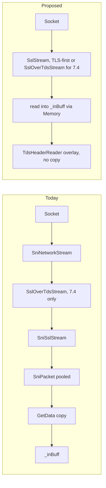

# 02 — A zero-copy read path and a thin transport reader

**Date**: 2026-06-29
**Scope**: The steady-state TDS read path on managed SNI (.NET) — copies, allocations, and layering
**Builds on**: [01 — managed SNI and the read path](01-managed-sni-and-read-path.md),
[03-roslyn anchors](../03-roslyn/blocking-and-allocations.md), and the
[reference explainers](README.md#reference-protocol-background)

---

## Goal

Turn the "candidate directions" from [01 §9](01-managed-sni-and-read-path.md) into a concrete
read-path design that (a) reads with modern `Memory<byte>` APIs, (b) removes the `SniPacket` staging
copy on the common path, (c) parses TDS/SMUX headers **in place** with no field copies, and (d)
gives the non-MARS TCP case a thin path while keeping MARS and TLS-over-TDS framing as branches.

This is the architectural superset of several [04-quick-wins](../04-quick-wins/README.md) items
(CMD-1, CMD-6, CE-1/2/3) — the quick wins are the incremental down-payments; this is the shape they
converge toward.

---

## What the read path costs today

### Copies (from [01 §4](01-managed-sni-and-read-path.md#4-the-copy-chain-are-we-copying-more-than-necessary))

Per received packet: kernel/`SslStream` internal copy, then `stream.Read → SniPacket._data`, then
(MARS only) `SniPacket.TakeData` `Buffer.BlockCopy`, then `SniPacket.GetData → _inBuff`
`Buffer.BlockCopy`, then `_inBuff → consumer` `Span.CopyTo`. **Copy #3 (`GetData → _inBuff`) exists
only because data was staged in a `SniPacket`.**

### Allocations (confirmed in [03-roslyn](../03-roslyn/blocking-and-allocations.md))

| Location | Pattern | Member | Path |
| --- | --- | --- | --- |
| `TdsParserStateObject.cs:2395,2419,2428` | `new byte[]` | `TryReadPlpBytes` | PLP read (CMD-1) |
| `TdsParserStateObject.cs:1726` | `new byte[]` | `TryReadByteArrayWithContinue` | continuation read (CMD-1) |
| `TdsParserStateObject.Multiplexer.cs:320,432,450` | `new byte[]` | `MultiplexPackets` | multiplexer (CMD-6) |
| `ConcurrentQueueSemaphore.netcore.cs:37` | `new TaskCompletionSource` | `WaitAsync` | per-contended I/O (CMD-3) |

These are the per-packet / per-read sinks. The header parses that drive them use **manual byte
shifting** (`Packet.cs:144-158`) — no overlay, no `BinaryPrimitives`.

---

## Design 1 — Modern, `Memory<byte>` socket reads

Replace the legacy `Stream.ReadAsync(byte[], int, int, CancellationToken)` plus `ContinueWith`
(`SniPacket.netcore.cs:267`) with `await stream.ReadAsync(Memory<byte>, CancellationToken)`. This
removes a `Task` continuation allocation, flows cancellation natively, and lets the destination be a
pooled `Memory<byte>` rather than a `byte[]`. This is the enabler for Designs 2–4.

---

## Design 2 — Collapse the `SniPacket` staging copy

For the **non-MARS** path, read directly into the parser's `_inBuff` (or hand the parser a
`ReadOnlyMemory<byte>`/`Span<byte>` view of the pooled read buffer) instead of staging in a
`SniPacket` and then `Buffer.BlockCopy`-ing via `GetData`. That deletes copy #3 outright. For the
MARS path, the demultiplexer still needs to split by session, but it can slice spans rather than
`TakeData`-copy into per-session `SniPacket`s (see Design 4).

---

## Design 3 — Parse headers in place (zero-copy overlay)

C# can read a struct's fields directly out of a buffer with no copy. The endian-correct, idiomatic
form is a `ref struct` reader over a `ReadOnlySpan<byte>`:

```csharp
internal readonly ref struct TdsHeaderReader
{
    private readonly ReadOnlySpan<byte> _b;
    public TdsHeaderReader(ReadOnlySpan<byte> b) => _b = b;

    public byte Type   => _b[0];
    public byte Status => _b[1];
    // TDS packet length is big-endian at offset 2
    public int DataLength => BinaryPrimitives.ReadUInt16BigEndian(_b.Slice(2)) - TdsEnums.HEADER_LEN;
}
```

No allocation, no field-by-field copy — the accessors read straight from the rented buffer. The SMUX
header (`SniSmuxHeader.netcore.cs:20-32`) already uses `BinaryPrimitives` but copies into struct
fields; the same `ref struct`-over-span treatment makes it copy-free too. (`MemoryMarshal.AsRef<T>`
is an option for fixed-layout same-endian structs, but the `ref struct` + `BinaryPrimitives` pattern
is safer because TDS headers are big-endian.)

---

## Design 4 — A thin TCP reader with MARS/TLS as branches

On Unix the transport is **TCP only** (see
[transports](reference/transports-tcp-vs-named-pipes.md)). The common case is TCP, no MARS. Today
that case still pays for `SniHandle` virtual dispatch, the `SniNetworkStream` wrapper, and the
`SniPacket` staging copy.



The proposed path keeps two **branches** for the cases that genuinely need framing:

- **MARS** → a channel-based demultiplexer that slices the read buffer per session instead of
  `Buffer.BlockCopy` into per-session packets (see [mars](reference/mars-session-multiplexing.md)).
- **TLS-over-TDS (7.4)** → `SslOverTdsStream` stays for `Encrypt != Strict`; under TDS 8.0 / strict
  it is skipped entirely (see [tds-8.0-tls-first](reference/tds-8.0-tls-first.md)), so the strict
  path is already the thin shape.

---

## What must be preserved

- **TLS-over-TDS framing for TDS 7.4** — `SslOverTdsStream`'s `0x12` encapsulation is a protocol
  requirement, not incidental (see [tds-7.4-tls-over-tds](reference/tds-7.4-tls-over-tds.md)).
- **MARS demultiplexing** — load-bearing; only the copy/lock mechanics change, not the capability.
- **Always Encrypted** cannot stream/zero-copy decrypted values; it keeps its buffered path.
- **net462** uses native SNI and is untouched — all of this is managed-SNI (`.netcore.cs`) only.
- **Behavioural contracts** — exception types, attention handling, and packet-size negotiation must
  be byte-for-byte preserved.

---

## Relationship to the 04 quick wins

| Quick win | This design |
| --- | --- |
| CE-1 async TCP connect, CE-2 async TLS, CE-3 async DNS | the open-path counterpart to Design 1 (modern async I/O) |
| CMD-1 pool snapshot `PacketData` | subsumed by Design 2 (don't stage/copy at all on the common path) |
| CMD-3 `ConcurrentQueueSemaphore` TCS | the locking/alloc that Design 1's `await` model removes pressure from |
| CMD-6 pool multiplexer `Packet` objects | folded into Design 4's slice-don't-copy demultiplexer |

The quick wins are shippable now (7.1, switches at default); this design is the direction they pay
down toward and should be validated with the same baseline benchmark harness (Feature 42261).

---

## Risk and confidence

Scored like the [04-quick-wins legend](../04-quick-wins/README.md#scoring-legend) — prefer low
**Blast**, high **Test / Locality / Cohesion**, plus **Async-isolated** and **Flag-gated**. Because
these are architectural, an **Effort** column (S/M/L) is added and confidences are lower than the
quick wins.

| Design | Blast / Test / Locality / Cohesion | Async-isolated | Flag-gated | Effort | Confidence |
| --- | --- | --- | --- | --- | --- |
| 1 — `Memory<byte>` socket reads | M / H / H / H | Y | Opt | S | 0.70 |
| 2 — collapse staging copy | H / M / M / M | N | Y | M | 0.55 |
| 3 — in-place header overlay | L / H / H / H | N | Opt | S | 0.72 |
| 4 — thin reader + channel MARS demux | H / M / L / M | N | Y | L | 0.45 |

Design 3 is the safest standalone win (isolated header parse, behaviour-preserving). Design 1 is
async-isolated and enables the rest. Designs 2 and 4 touch the shared packet path and MARS — higher
blast, so both must be flag-gated and benchmarked.

### Risk-lowering considerations

- **Flag-gate the shared-path changes** (Designs 2 and 4) behind a `LocalAppContextSwitches` opt-in,
  defaulting off, with a runtime kill switch — the same pattern as `UseCompatibilityProcessSni`.
- **Pooling correctness** — Designs 1 and 2 hand pooled `Memory<byte>` to the parser; enforce
  rent-then-return ownership and debug-mode buffer poisoning to avoid use-after-return corruption.
- **MARS soak plus on/off** — Design 4's demultiplexer rewrite is the PR #1357 hazard zone; require
  a 1-hour soak and MARS on/off validation before default.
- **Behavioural contracts** — preserve exception types, attention handling, packet-size negotiation,
  and TLS-over-TDS framing for `Encrypt != Strict` byte-for-byte.
- **Benchmark baseline** — validate each design against the Feature 42261 harness; ship the cheap,
  async-isolated ones (1, 3) first.
- **Sequencing** — 1 then 3 then 2 then 4 (the phased path below); they share the slice-don't-copy
  and `Memory` primitives, so this order avoids rework.

---

## Phased path

1. **Design 1** (Memory-based reads) — low risk, enables the rest.
2. **Design 3** (in-place header overlay) — low risk, isolated to header parse.
3. **Design 2** (collapse staging copy) on the non-MARS path — medium risk, behind a switch.
4. **Design 4** (thin reader + channel MARS demux) — highest scope; sequence after the multiplexer
   (`UseCompatibilityProcessSni=false`) is proven, since it shares the slice-don't-copy idea.

---

## References

- [01 — managed SNI and the read path](01-managed-sni-and-read-path.md)
- [03-roslyn blocking-and-allocations](../03-roslyn/blocking-and-allocations.md)
- Reference: [transports](reference/transports-tcp-vs-named-pipes.md),
  [tds-7.4-tls-over-tds](reference/tds-7.4-tls-over-tds.md),
  [tds-8.0-tls-first](reference/tds-8.0-tls-first.md),
  [mars-session-multiplexing](reference/mars-session-multiplexing.md)
- [04-quick-wins](../04-quick-wins/README.md)
