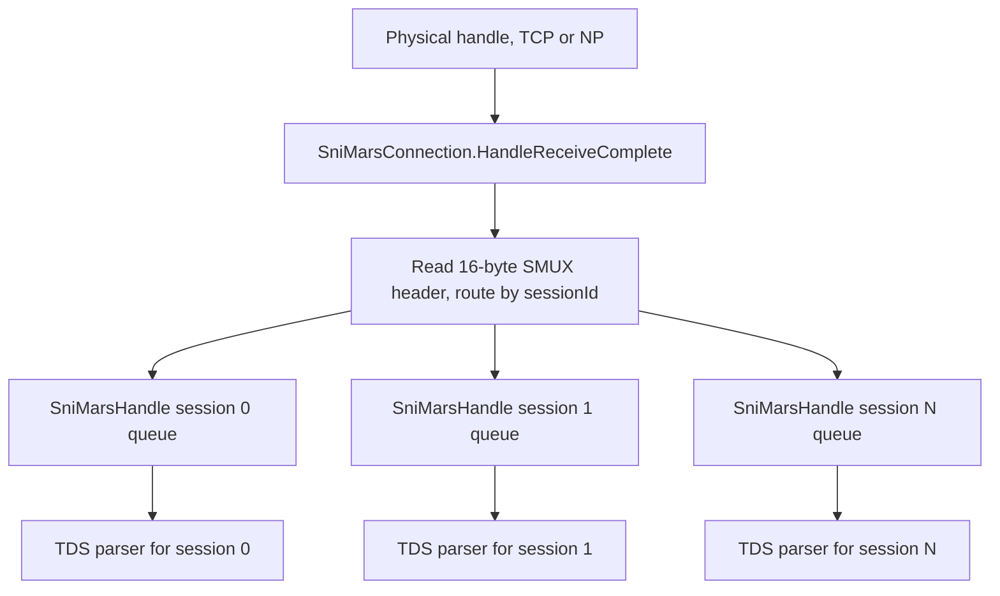

# Reference — MARS and session multiplexing (SMUX)

How Multiple Active Result Sets multiplexes logical sessions over one physical connection. Source
references relative to `src/Microsoft.Data.SqlClient/src/Microsoft/Data/SqlClient/`.

---

## What MARS provides

MARS (Multiple Active Result Sets) lets a single physical connection carry **several concurrent
logical sessions** — for example, iterating one reader while issuing other commands on the same
connection. Without MARS, a connection has one logical session and one outstanding command at a time.

---

## The SMUX framing

MARS is implemented with the **SMUX** (session multiplexing) sub-protocol: every TDS packet is
prefixed with a fixed **SMUX header** so the demultiplexer can route it to the right session. The
header is parsed in `SniSmuxHeader.Read` (`SniSmuxHeader.netcore.cs:20-32`):

| Field | Bytes | Purpose |
| --- | --- | --- |
| `SMID` | 1 | SMUX marker byte |
| `flags` | 1 | SYN / ACK / FIN / DATA control |
| `sessionId` | 2 | which logical session this packet belongs to |
| `length` | 4 | SMUX payload length |
| `sequenceNumber` | 4 | per-session ordering |
| `highwater` | 4 | flow-control window |

So MARS adds **16 bytes of header per packet** and a control protocol (SYN/ACK/FIN, highwater flow
control) on top of TDS.

---

## Demultiplexing

- `SniMarsConnection` wraps the physical handle and holds `Dictionary<int, SniMarsHandle> _sessions`
  (`SniMarsConnection.netcore.cs:8-27`). Its `HandleReceiveComplete` reads the SMUX header, copies
  the payload into the per-session packet (`packet.TakeData` → `Buffer.BlockCopy`,
  `SniMarsConnection.netcore.cs:256-262`), and enqueues it.
- `SniMarsHandle` is one logical session: receive/send queues, sequence numbers, and
  `_sendHighwater`/`_receiveHighwater` flow control (`SniMarsHandle.netcore.cs:12-30`).

---

## Costs (why MARS is a perf hotspot)

- **Per-packet header overhead** (16 bytes) reduces effective payload and can force an extra network
  packet.
- **An extra demux copy** per packet on the MARS path (`TakeData` → `Buffer.BlockCopy`).
- **Global demultiplexer locking** (`lock(DemuxerSync)`) serializes all sessions — a primary
  Unix starvation vector (issue [#422](https://github.com/dotnet/SqlClient/issues/422)).

---

## Why this matters for redesign

MARS is **load-bearing** — it is the main reason a multiplexing layer must exist above the physical
transport. But its current implementation (global lock, per-packet demux copy) is also where managed
SNI hurts most under concurrency. A redesign that keeps a focused, channel-based MARS demux while
giving the **non-MARS common case** a thin, copy-light path is the high-value split. See
[../01-managed-sni-and-read-path.md](../01-managed-sni-and-read-path.md) and the quick-win
[CE-5](../../04-quick-wins/connection-establishment/05-semaphoreslim-handle-locks.md).
