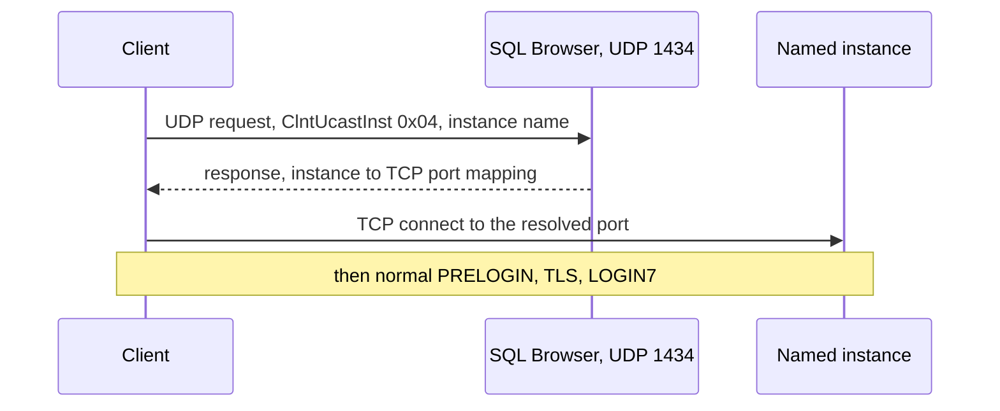

# Reference — SSRP (SQL Server Resolution Protocol)

How SqlClient resolves a named instance to a port before it can connect. Source references relative
to `src/Microsoft.Data.SqlClient/src/Microsoft/Data/SqlClient/`.

---

## What SSRP is for

A **named instance** (e.g. `myserver\SQLEXPRESS`) usually listens on a **dynamic TCP port**, not the
default 1433. SSRP — spoken to the **SQL Server Browser** service over **UDP port 1434** — maps an
instance name to its current TCP port (or named-pipe name). The client must do this lookup *before*
it can open the TDS connection.

Default instances do **not** need SSRP: they connect to TCP 1433 directly.

---

## Flow

---

## Mechanics in code

`SsrpClient` (`SsrpClient.netcore.cs`) implements the protocol:

- `SqlServerBrowserPort = 1434` (`SsrpClient.netcore.cs:23`).
- **Unicast instance lookup** uses request byte `ClntUcastInst = 0x04` followed by the instance name
  (`SsrpClient.netcore.cs:94,99`), sent via `SendUDPRequest` (`SsrpClient.netcore.cs:50`).
- **Broadcast enumeration** (`CLNT_BCAST_EX`) discovers instances on the subnet
  (`SsrpClient.netcore.cs:414`).
- **DAC port lookup** resolves the Dedicated Admin Connection port (`SsrpClient.netcore.cs:121`).

`SniProxy` invokes SSRP during connection setup when an instance name needs resolving
(`SniProxy.netcore.cs:253-258`).

---

## When it is (and is not) used

| Data source | SSRP needed? |
| --- | --- |
| `tcp:host,1433` or `host` (default instance) | No — connects to 1433 directly |
| `host\INSTANCE` (named instance, no port) | **Yes** — UDP 1434 lookup |
| `host,1500` (explicit port) | No — port is known |
| Named Pipes `np:` | No — pipe name inferred, not SSRP |

---

## Why this matters for redesign

SSRP is a **connection-establishment** concern (a one-time UDP round trip), not a steady-state read
cost. It belongs to the "open" path analyzed in
[../../04-quick-wins/connection-establishment](../../04-quick-wins/README.md). A redesign of the
steady-state read path does not touch SSRP, but a full connection-open redesign should make the UDP
lookup async and overlap it with other setup work, since it is one more place the open path can block
a thread.
