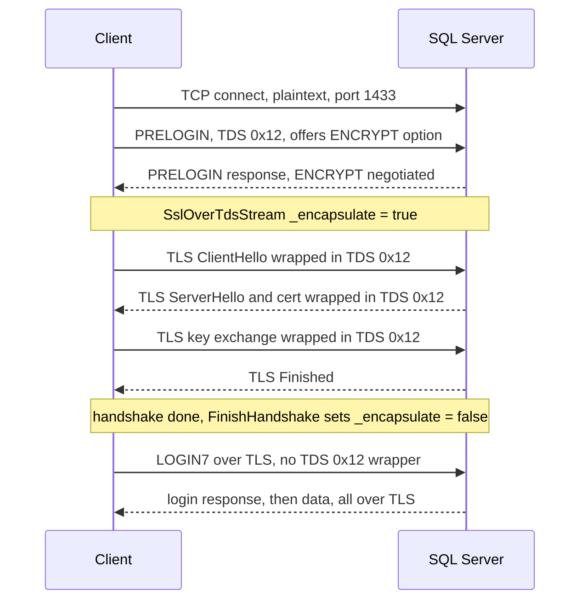

# Reference — TDS 7.4 TLS-over-TDS encryption flow

How encryption is negotiated and established on the legacy TDS 7.x path (the default before
`Encrypt=Strict`). Source references relative to
`src/Microsoft.Data.SqlClient/src/Microsoft/Data/SqlClient/`.

---

## The idea

In TDS 7.x the connection starts as **plaintext TCP**. Encryption is negotiated in the **PRELOGIN**
exchange, and then the **TLS handshake records are tunnelled inside TDS packets** (message type
`0x12`). Once the handshake completes, the TDS wrapping is dropped and TLS protects the byte stream
underneath normal TDS framing. This is what `SslOverTdsStream` exists for
(`SslOverTdsStream.netcore.cs:18-19`):

> "SSL encapsulated over TDS transport. During SSL handshake, SSL packets are transported in TDS
> packet type 0x12. Once SSL handshake has completed, SSL packets are transported transparently."

---

## Flow

---

## Encryption levels

The PRELOGIN `ENCRYPTION` option negotiates one of: `OFF`, `ON`, `NOT_SUP`, `REQ`. The connection
string `Encrypt` keyword maps to these:

- `Encrypt=Optional/false` → encrypt only if the server requires it.
- `Encrypt=Mandatory/true` (current default) → full-session encryption required.

Historically TDS 7.x could encrypt **only the login packet** and then continue in plaintext; modern
defaults encrypt the whole session.

---

## Mechanics in code

- `SslOverTdsStream` prepends a TDS `0x12` header to each outbound TLS record while `_encapsulate`
  is true (`SslOverTdsStream.netcore.cs:31,48`), and reads the TDS packet header to de-frame inbound
  records (`SslOverTdsStream.netcore.cs:151,231`).
- `FinishHandshake()` flips `_encapsulate = false` (`SslOverTdsStream.netcore.cs:52-56`); after that
  the stream is a pass-through and `SniSslStream` carries raw TLS.

---

## Why this matters for redesign

TLS-over-TDS is a genuine protocol requirement, **not** incidental complexity — it is the reason a
framing layer (`SslOverTdsStream`) must sit between the socket and `SslStream` on the 7.x path. Any
"thin reader" redesign must preserve this for `Encrypt != Strict`. Contrast with
[tds-8.0-tls-first](tds-8.0-tls-first.md), which removes the tunnelling entirely.
