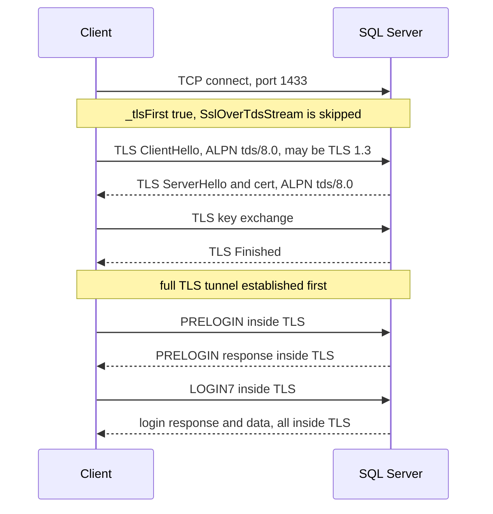

# Reference — TDS 8.0 TLS-first (strict) encryption flow

How encryption works under `Encrypt=Strict` / TDS 8.0 (SQL Server 2022+). Source references relative
to `src/Microsoft.Data.SqlClient/src/Microsoft/Data/SqlClient/`.

---

## The idea

TDS 8.0 abandons TLS-over-TDS tunnelling. The connection does a **standard TLS handshake first** —
exactly like HTTPS — and then **all** TDS traffic, including PRELOGIN and LOGIN7, flows inside the
TLS tunnel. There is no TDS `0x12` wrapping of handshake records. The handshake advertises **ALPN
`tds/8.0`** so the server knows a TDS 8.0 session is intended.

In code this is the `_tlsFirst` path: when `tlsFirst` is true the handle skips `SslOverTdsStream`
entirely and negotiates TLS directly, offering the TDS 8.0 ALPN protocol
(`SniHandle.netcore.cs:24,31`):

```text
s_tdsProtocols = new List<SslApplicationProtocol> { new(TdsEnums.TDS8_Protocol) };  // "tds/8.0"
```

`tlsFirst` is described in `SniProxy` as "Support TDS8.0" (`SniProxy.netcore.cs:46,63`).

---

## Flow



---

## Why TDS 8.0 is better

- **Standard TLS.** Works cleanly with TLS-inspecting proxies, load balancers, and gateways that do
  not understand TLS-over-TDS framing.
- **TLS 1.3.** The strict path enables modern TLS, including 1.3, with the usual handshake.
- **Simpler client.** No `SslOverTdsStream` encapsulation layer on the hot path — one fewer stream
  wrapper and no `0x12` de-framing while reading handshake records.
- **Everything encrypted from byte zero**, including PRELOGIN, closing the small pre-handshake
  plaintext window of the 7.x path.

---

## Why this matters for redesign

TDS 8.0 is the direction of travel, and it is **architecturally cleaner** for a managed fast path:
no TLS-over-TDS framing means the read path is `Socket → SslStream → TDS packets` with one fewer
layer. A redesign should treat the strict/TLS-first path as the primary shape and keep the 7.x
`SslOverTdsStream` tunnelling (see [tds-7.4-tls-over-tds](tds-7.4-tls-over-tds.md)) as the
compatibility branch.
