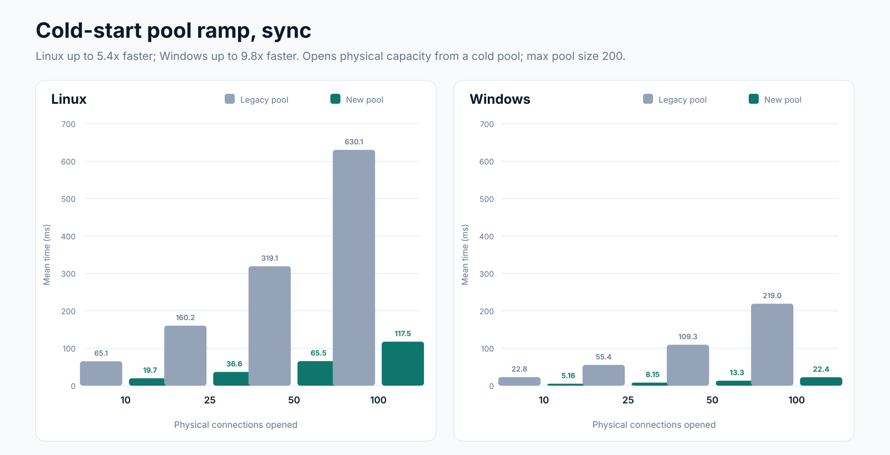
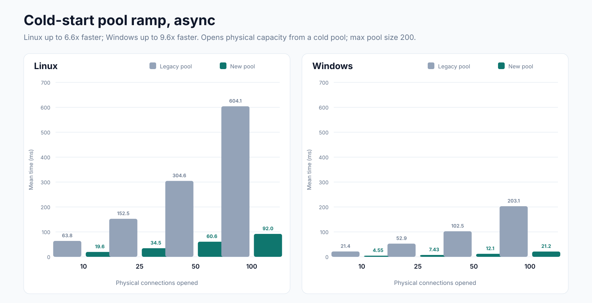

# Faster connection ramp-up: Try SqlClient’s new connection pool

When your application starts up or receives a burst of traffic, several requests may need database connections at once. Connection Pool V2 lets the driver establish those connections concurrently, helping the pool meet demand faster.

You can try it today with a single startup setting. We plan to make Pool V2 the default in Microsoft.Data.SqlClient 8.0, and we’d like your feedback before then. Try it with your workload and tell us what improves, what stays the same, and what needs attention.

## Try Pool V2 in your application
The new pool is available as of Microsoft.Data.SqlClient 7.1.0. Enable it at application startup, before any database connections are opened:

```c#
AppContext.SetSwitch(
    "Switch.Microsoft.Data.SqlClient.UseConnectionPoolV2",
    true);
```

Place this at the beginning of your application’s entry point, before initializing services that might access the database. For ASP.NET Core applications, put it before creating the application builder.

That’s the only code change needed to select the new pool. Your existing connection strings and database-access code stay the same. This also applies to EF Core and Dapper applications that use Microsoft.Data.SqlClient.

For your first comparison, change only the Pool V2 switch. Keep the package version, workload, connection string, and other settings unchanged.

**Want to switch back?** Set the switch to `false` and restart your application. Pool V2 remains opt-in throughout the 7.x release band.

## Performance improvements

### Concurrent connection establishment
Pool V2 is designed to reduce connection establishment latency under concurrent workloads. Unlike the legacy pool, Pool V2 can establish new connections concurrently, allowing a pool to grow more quickly when multiple requests require new connections at the same time. For example:

- An application queries several pieces of metadata during startup. Under the legacy pool, only one request can open a new connection at a time, which can extend startup time.
- An application receives a burst of traffic after a quiet period. The legacy pool can take longer to scale up after a quiet period. Increasing `Min Pool Size` can reduce that delay, but it also retains connections while demand is low.

#### Synchronous cold-start results

**With 100 concurrent callers on Linux, Pool V2 reduced mean cold-start benchmark time from 630.1 ms to 117.5 ms, a 5.4x speedup.**



*Synchronous callers use dedicated threads with Open(). Each caller holds its connection until all opens complete. Lower times are better.*

#### Asynchronous cold-start results

**With 100 concurrent callers on Linux, Pool V2 reduced mean cold-start benchmark time from 604.1 ms to 92.0 ms, a 6.6x speedup.**



*Asynchronous callers use tasks with OpenAsync(). Each caller holds its connection until all opens complete. Lower times are better.*

#### What these benchmarks measure

Each test clears the pool, then times `N` concurrent callers opening and holding exactly `N` physical connections until all opens complete. The measured time includes connection creation, synchronization, and returning connections to the pool. Pool clearing and setup are excluded. The charts show mean time for the complete operation, not latency for an individual connection open.

Tests cover 10, 25, 50, and 100 concurrent callers with `Max Pool Size=200`.

> Tests were run on Linux and Windows VMs against SQL Server instances on the same machine to reduce network variability. These results measure cold-start connection establishment and coordination, not SQL query execution or reuse of an already-warm pool. Results will vary with your workload and network latency.
>Full benchmark source code is available in the [dotnet/SqlClient](https://github.com/dotnet/SqlClient) github repository.

### Designed for Async Workloads
Pool V2 is also built from the ground up to be async friendly. The core of the design is the [System.Threading.Channels](https://learn.microsoft.com/en-us/dotnet/api/system.threading.channels) library. Channels provide a highly optimized producer/consumer API with first class async support. The legacy pool relies heavily on dedicated background threads, increasing overhead for applications that connect to many different databases.

Thanks to the [npgsql](https://www.npgsql.org/index.html) driver team who paved the way on this pooling design.

> Note:
>
>`SqlConnection.OpenAsync()` is not yet fully asynchronous down to individual network calls. As a result, Pool V2 queues work items on managed thread-pool threads that perform synchronous network calls. Threads blocked on network calls can degrade scheduling and force the managed thread-pool to grow, which can be a relatively slow process. Waiting for new managed threads can introduce measurable end-user latency. Applications that experience high latency to their SQL Server instance should keep an eye out for increased pressure on the managed thread-pool. If necessary, you can correct this situation by increasing the managed thread pool size or by enforcing a concurrency limit on database operations. Microsoft.Data.SqlClient 8.0 will correct these blocking network calls.

## Additional settings to evaluate separately

These settings are not required to try Pool V2. After comparing the pools with your existing configuration, consider evaluating these settings as well. The switches below also apply to the legacy pool.

### AppContext switches
| Setting | Value to evaluate | Effect |
|---|---|---|
| `Switch.Microsoft.Data.SqlClient.UseLegacyIdleTimeoutBehavior` | `false` | Enables enforcement of the connection string's `Connection Idle Timeout` value. |
| `Switch.Microsoft.Data.SqlClient.UseOverallConnectTimeoutForPoolWait` | `true` | Counts time spent waiting for a pooled connection against the caller's overall `Connect Timeout` budget. |

### Connection string properties

| Property | Starting value | Effect |
|---|---:|---|
| `Connection Idle Timeout` | `300` seconds (default) | With legacy idle-timeout behavior disabled, retires idle connections according to the configured timeout. Choose a value appropriate for your network's idle limits. |

## Help shape the default in 8.0

Try Pool V2 with a representative workload and compare it with the legacy pool. Useful scenarios include:

- Application startup.
- Traffic bursts after a quiet period.
- High concurrent demand for database connections.
- Higher-latency connections to SQL Server.

**Faster startup, unchanged results, and regressions are all useful feedback.** Share your comparison in [GitHub Issues](https://github.com/dotnet/SqlClient/issues).