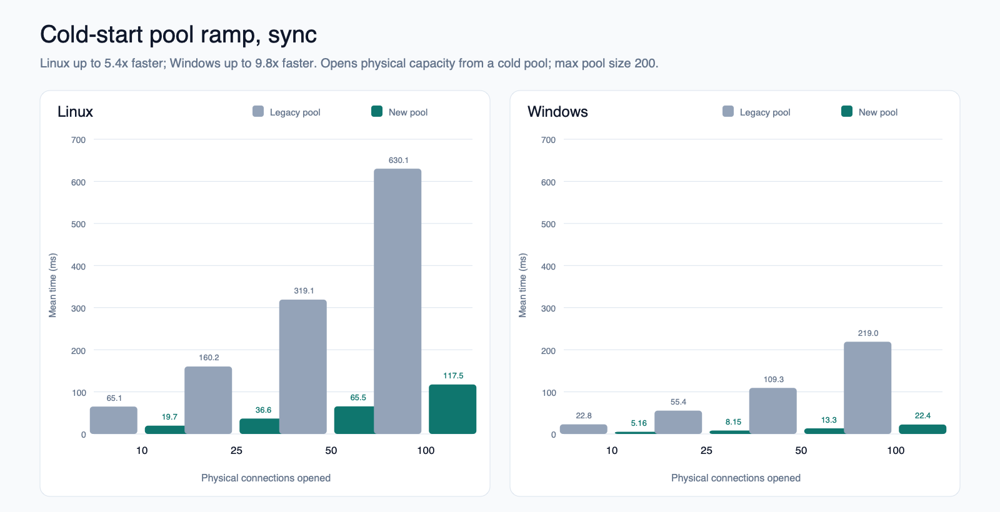
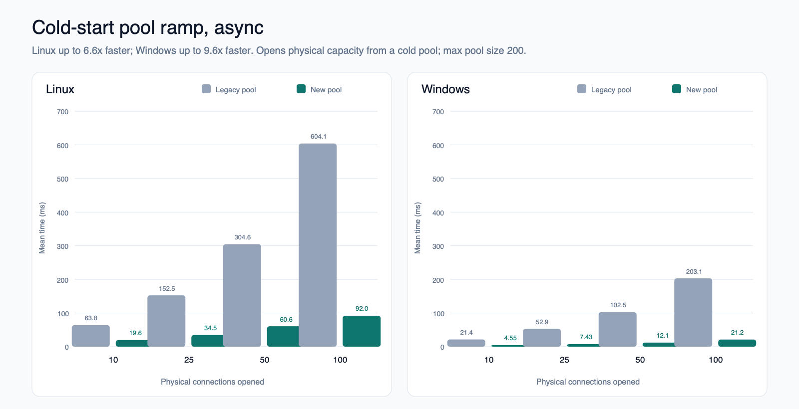
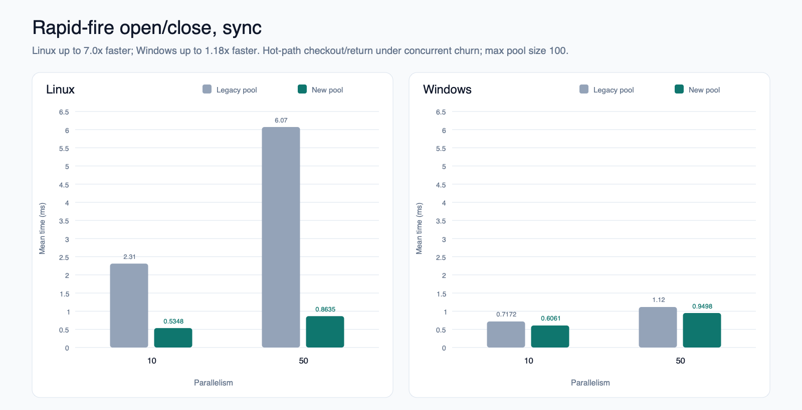
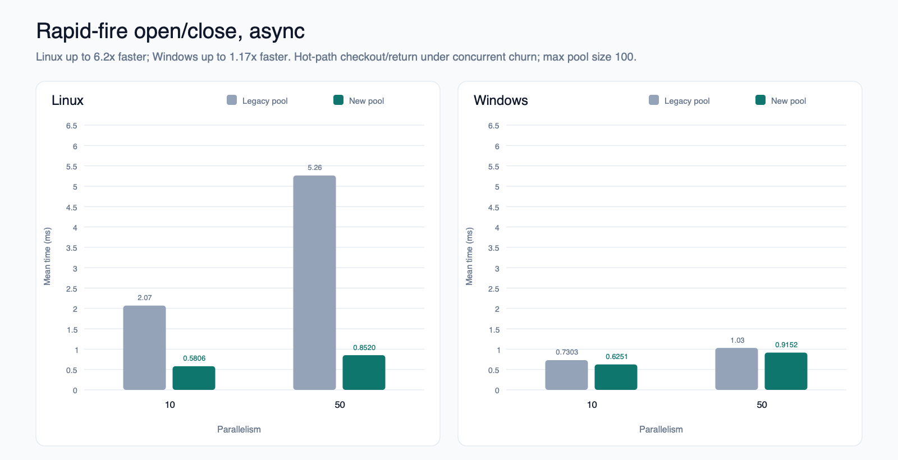

# Connection Pool V2 performance comparison

This package compares the legacy `WaitHandleDbConnectionPool` with the new
channel-based connection pool using 68 matching benchmark and parameter rows on
Linux and Windows.

## Start here

- [Pool V2 blog post](PoolV2BlogPost.md)
- [Interactive report](index.html)
- [Full ordered benchmark results](05-full-benchmark-results.svg)

## Highlighted results

| Benchmark | Linux | Windows |
|---|---:|---:|
| Cold-start ramp, sync | Up to 5.4x faster | Up to 9.8x faster |
| Cold-start ramp, async | Up to 6.6x faster | Up to 9.6x faster |
| Rapid-fire open/close, sync | Up to 7.0x faster | Up to 1.18x faster |
| Rapid-fire open/close, async | Up to 6.2x faster | Up to 1.17x faster |

### Cold-start ramp

The test clears the pool, then times `N` concurrent callers opening and holding
exactly `N` physical connections until all opens complete. The result includes
connection creation, synchronization, and pool return, but excludes pool
clearing and setup. Sync uses dedicated threads with `Open()`; async uses tasks
with `OpenAsync()`.

[](01-cold-start-sync.svg)

[](02-cold-start-async.svg)

### Rapid-fire open/close

The test uses a fully pre-warmed pool and repeatedly checks connections out and
returns them immediately. It measures a zero-hold-time worst case for the hot
acquire, return, and waiter-handoff paths.

[](03-rapid-fire-sync.svg)

[](04-rapid-fire-async.svg)

## Methodology

- The same Release build runs in separate processes with
  `UseConnectionPoolV2=false` for the legacy pool and `true` for Pool V2.
- Benchmark units run legacy then Pool V2 back to back on the same platform and
  reserved CPU set.
- BenchmarkDotNet uses the in-process MediumRun job on `net9.0`, Server GC,
  `MemoryDiagnoser`, and `ThreadingDiagnoser`.
- Slowdowns above 10% are rerun across three total passes and confirmed only
  when they reproduce in a strict majority.
- Speedup is calculated within each platform as `legacy mean / Pool V2 mean`.
  Absolute milliseconds should not be compared across Linux and Windows because
  they are separate machine runs.

The interactive report contains the full environment description, benchmark
glossary, parameter matrix, and platform-specific regression notes. The Windows
results came from
[Azure DevOps build 170431](https://sqlclientdrivers.visualstudio.com/ADO.Net/_build/results?buildId=170431&view=ms.vss-build-web.run-extensions-tab).

## Package contents

| Path | Description |
|---|---|
| `PoolV2BlogPost.md` | Shareable draft blog post |
| `index.html` | Interactive report |
| `01-*.{png,svg}` through `05-*.{png,svg}` | Generated charts |
| `data/linux-results.txt` | Raw Linux comparison |
| `data/windows-results.txt` | Raw Windows comparison |
| `generate.py` | Dependency-free chart and report generator |

## Regenerate

From this directory:

```bash
python3 generate.py \
  data/linux-results.txt \
  data/windows-results.txt \
  .
```

The generator rewrites `index.html` and all PNG/SVG chart files.
