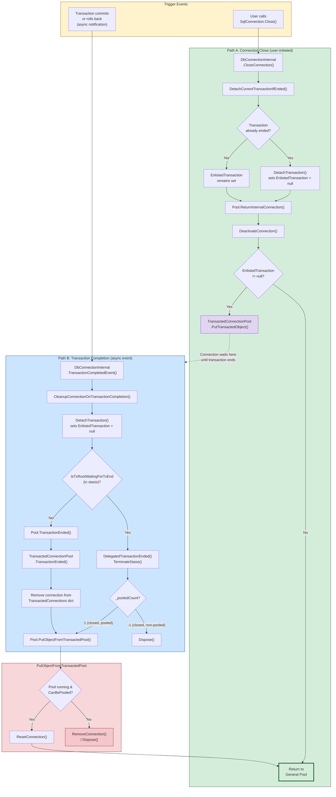

# Transacted Connection Return Paths

This document describes all the ways that a connection enlisted in a `System.Transactions.Transaction` can be freed from the `TransactedConnectionPool` and returned to the general connection pool (or destroyed).

There are **two trigger events** and **three distinct paths**.

## Diagram

## Path A: User closes the connection (`SqlConnection.Close()`)

1. `DbConnectionInternal.CloseConnection()` is called.
2. `DetachCurrentTransactionIfEnded()` checks if the enlisted transaction is already dead — if so, it clears `EnlistedTransaction` right there.
3. `Pool.ReturnInternalConnection()` is called, which calls `DeactivateConnection()` and then checks `EnlistedTransaction`:
   - **If still enlisted** (transaction is active): the connection goes to `TransactedConnectionPool.PutTransactedObject()` where it **waits** until Path B fires.
   - **If not enlisted** (transaction already ended or none): returns directly to the general pool (idle channel / wait handle).

## Path B: Transaction completes asynchronously (commit or rollback)

The `TransactionCompleted` event fires on `DbConnectionInternal`, which calls `CleanupConnectionOnTransactionCompletion()`. This has **two sub-paths**:

### B1 — Normal path (connection is in the transacted pool)

1. `DetachTransaction()` clears `EnlistedTransaction`.
2. `Pool.TransactionEnded()` → `TransactedConnectionPool.TransactionEnded()` removes the connection from the `TransactedConnections` dictionary.
3. `Pool.PutObjectFromTransactedPool()` calls `ResetConnection()` and returns it to the general pool.

### B2 — Stasis path (delegated transaction root)

This path applies when a connection is a delegated transaction root and was closed while the pool was shutting down or the connection had no pool reference.

1. `DetachTransaction()` sees `IsTxRootWaitingForTxEnd == true`.
2. `DelegatedTransactionEnded()` fires, calls `TerminateStasis()`, then:
   - If `_pooledCount == 1` (closed, pooled): calls `Pool.PutObjectFromTransactedPool()` → general pool.
   - If `_pooledCount == -1` with no owner (closed, non-pooled): calls `Dispose()` — connection is destroyed.

## Race condition: Close and TransactionCompleted fire simultaneously

This is by design. `CloseConnection()` calls `DetachCurrentTransactionIfEnded()` **before** returning to the pool, so if the transaction has already completed, the connection goes straight to the general pool via Path A (with `EnlistedTransaction == null`). If the transaction is still active at close time, the connection parks in the transacted pool and Path B handles the return later. The lock inside `DetachTransaction()` on the transaction object prevents both paths from racing.

## The `PutObjectFromTransactedPool` funnel

All paths that return a post-transaction connection converge on `PutObjectFromTransactedPool()`, which does a final gate check:

- **Pool running + `CanBePooled`**: `ResetConnection()` → general pool.
- **Otherwise**: connection is destroyed/disposed.

## Key source files

| File | Relevant methods |
|------|-----------------|
| `src/.../ProviderBase/DbConnectionInternal.cs` | `CloseConnection`, `DetachCurrentTransactionIfEnded`, `DetachTransaction`, `TransactionCompletedEvent`, `CleanupConnectionOnTransactionCompletion`, `DelegatedTransactionEnded`, `SetInStasis` |
| `src/.../ConnectionPool/TransactedConnectionPool.cs` | `GetTransactedObject`, `PutTransactedObject`, `TransactionEnded` |
| `src/.../ConnectionPool/WaitHandleDbConnectionPool.cs` | `ReturnInternalConnection`, `DeactivateObject`, `PutObjectFromTransactedPool`, `TransactionEnded`, `GetFromTransactedPool` |
| `src/.../ConnectionPool/ChannelDbConnectionPool.cs` | `ReturnInternalConnection`, `PutObjectFromTransactedPool`, `TransactionEnded`, `GetFromTransactedPool` |
