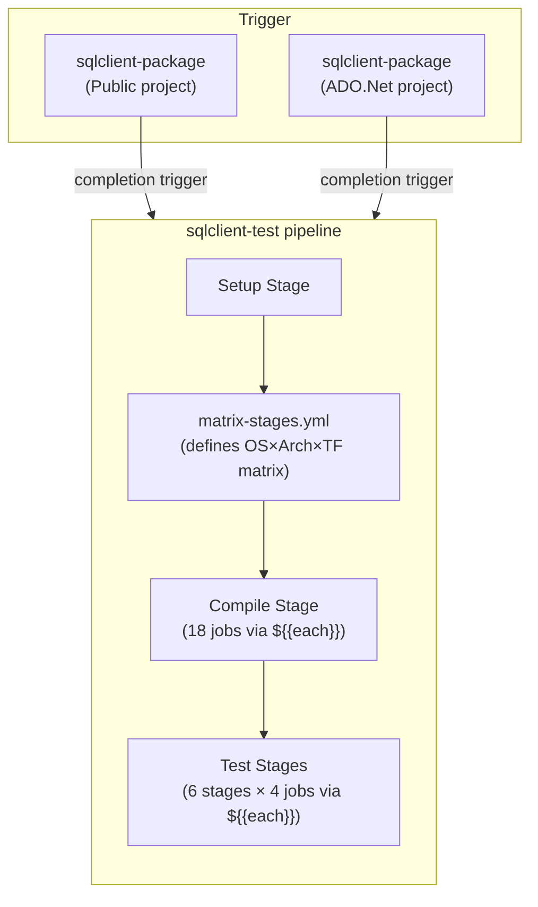
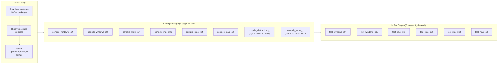
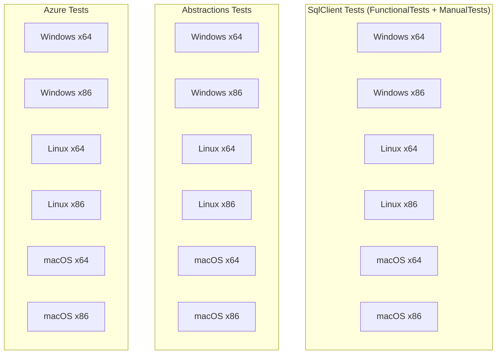
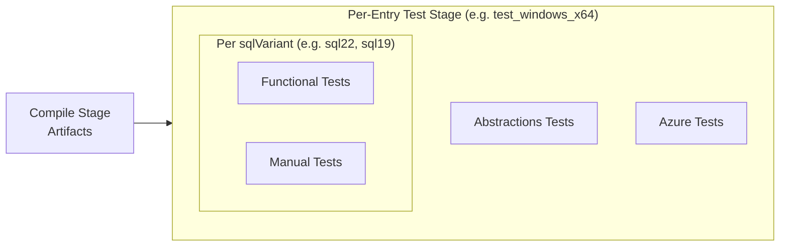

# SqlClient Test Pipeline

The `sqlclient-test` pipeline compiles and runs the SqlClient test suite across a matrix of **OS × Architecture × Target Framework** combinations.

## When / Where It Runs

| Trigger | Behavior |
|---------|----------|
| PR | **Disabled** (`pr: none`) |
| Branch push | **Disabled** (`trigger: none`) |
| Pipeline completion | **Enabled** — auto-triggers when `sqlclient-package` completes in the **Public** or **ADO.Net** Azure DevOps projects |
| Manual | Queued via the Azure DevOps Pipelines UI |

## Parameters

| Parameter | Type | Default | Description |
|-----------|------|---------|-------------|
| `buildConfiguration` | `string` | `Release` | MSBuild configuration (`Debug` or `Release`) |
| `debug` | `boolean` | `false` | Enable verbose diagnostic output |
| `dotnetVerbosity` | `string` | `normal` | `dotnet` CLI verbosity (`quiet` / `minimal` / `normal` / `detailed` / `diagnostic`) |

## Pipeline Resources

| Alias | Project | Source Pipeline | Purpose |
|-------|---------|----------------|---------|
| `sqlclientPackagePublic` | Public | `sqlclient-package` | Provides NuGet packages for test compilation |
| `sqlclientPackageAdo` | ADO.Net | `sqlclient-package` | Same, from the ADO.Net project |

Both have `trigger: true` so a successful package build automatically starts this test pipeline.

## Execution Matrix

| OS | Architecture | Target Framework | Pool | Image |
|----|-------------|-----------------|------|-------|
| Windows | x64, x86 | net9.0 | `ADO-CI-1ES-Pool` | `ADO-MMS22-SQL22` |
| Linux | x64, x86 | net9.0 | `ADO-CI-1ES-Pool` | `ADO-UB22-SQL22` |
| macOS | x64, x86 | net9.0 | `Azure Pipelines` (hosted) | `macos-latest` |

## Pipeline Flow



## Architecture: Matrix-Driven Stage Generation

The pipeline uses a **wrapper template pattern** to define the test matrix as structured
data and generate compile/test stages dynamically:

```text
sqlclient-test.yml
  └── stages/matrix-stages.yml        ← owns the matrix (object parameter with defaults)
        ├── stages/compile-stage.yml   ← iterates matrix with ${{ each }}
        └── stages/test-stage.yml      ← iterates matrix with ${{ each }}
```

**Why this pattern?**
- The matrix is large (6 entries with 6 fields each) and would clutter the top-level file.
- The matrix is static configuration — not overridable at queue time. It changes only via PRs.
- Centralizing the matrix in one file ensures compile and test stages always agree on
  artifact names, pool assignments, and platform combinations.

**To add or modify a platform cell**, edit the `matrix` default in `stages/matrix-stages.yml`.
Each entry has the schema:

```yaml
- os: Windows          # Proper-cased; used as operatingSystem param for test jobs
  arch: x64            # CPU architecture (x64 or x86)
  targetFramework: net9.0
  poolName: $(ciPoolName)         # runtime variable; resolved per ADO project
  image: ADO-MMS22-SQL22          # compile + SQL-independent test image
  sqlVariants:                    # SQL-dependent tests fan out per variant
    - name: sql22                 # short identifier (used in job names)
      poolName: $(ciPoolName)     # test agent pool for this variant
      image: ADO-MMS22-SQL22      # agent image with this SQL Server version
```

Pool addressing is derived from the pool name at compile time:
- `Azure Pipelines` → `vmImage` (hosted)
- anything else → `imageOverride` demand (1ES self-hosted)

The `$(ciPoolName)` variable is defined in `common-variables.yml` based on
`System.TeamProject` (resolves to the correct pool per ADO project). macOS
entries use the literal `Azure Pipelines` instead.

**Compile-once, test-many**: compile-stage.yml iterates entries and ignores `sqlVariants`.
test-stage.yml uses a nested `${{ each variant in entry.sqlVariants }}` to generate
Functional and Manual test jobs per variant, while Abstractions and Azure tests
(SQL-independent) run once per entry.

## Stage Detail



## Compile Stage Jobs

Each compile job builds test binaries once and publishes them as a pipeline artifact. Test jobs download these artifacts and run with `--no-build`.



## Test Stage Jobs (per matrix entry)

Each matrix entry produces one test stage. SQL-dependent jobs (Functional, Manual)
fan out per `sqlVariant`; SQL-independent jobs (Abstractions, Azure) run once:



With one variant this produces 4 jobs per stage; adding a second variant adds 2 more
jobs (functional + manual) without recompiling.

## Directory Layout

```text
eng/pipelines/ci/test/
├── sqlclient-test.yml              # Top-level pipeline definition
├── stages/
│   ├── setup-stage.yml             # Downloads packages, resolves versions
│   ├── matrix-stages.yml           # Matrix definition + delegates to compile/test
│   ├── compile-stage.yml           # Builds test binaries (${{ each }} over matrix)
│   └── test-stage.yml              # Runs tests (${{ each }} over matrix → 6 stages)
├── jobs/
│   ├── compile-tests-job.yml       # Compiles SqlClient Functional+Manual tests
│   ├── compile-buildproj-target-job.yml  # Compiles via build.proj target (Abstractions, Azure)
│   ├── run-functional-tests-job.yml      # Runs FunctionalTests
│   ├── run-manual-tests-job.yml          # Runs ManualTests (iterates test sets)
│   ├── run-abstractions-tests-job.yml    # Runs Abstractions tests
│   └── run-azure-tests-job.yml           # Runs Azure extension tests
├── steps/
│   ├── configure-test-config-step.yml    # Writes test connection config
│   └── publish-results-step.yml          # Publishes .trx test results
├── variables/
│   └── common-variables.yml        # Shared variables + secret group imports
└── scripts/                        # Helper scripts used by steps
```

## Variable Groups

| Group | Contents | Used By |
|-------|----------|---------|
| `ADO Test Configuration Properties` | `SQL_TCP_CONN_STRING`, `SQL_NP_CONN_STRING` | Manual test jobs (via `configure-test-config-step.yml`) |

## Key Design Decisions

1. **Matrix-driven generation**: The OS×Arch×TF matrix lives in `stages/matrix-stages.yml` as a structured object parameter. Compile and test stages iterate over it with `${{ each }}`, eliminating per-cell boilerplate and ensuring artifact name consistency.

2. **Compile-once, run-many**: Test binaries are compiled once per OS×Arch×TF and published as pipeline artifacts. Test jobs download and run with `--no-build`, eliminating redundant compilation.

3. **Package mode**: All compilation uses `-p:ReferenceType=Package` so tests are built against the NuGet packages produced by the upstream `sqlclient-package` pipeline (not project references).

4. **Stage dependencies**: Both Compile and Test stages depend on Setup to ensure package versions are resolved before any build or test execution.

5. **Cross-project triggering**: The pipeline accepts packages from either the `Public` or `ADO.Net` Azure DevOps project, supporting both open-source and internal build flows.
