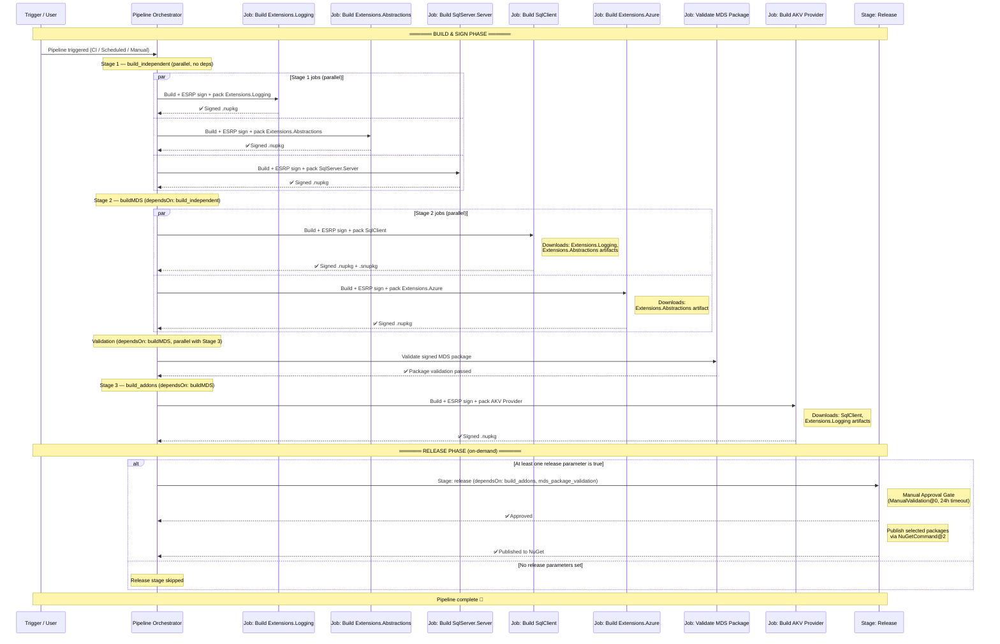

# Multi-Product Azure DevOps Pipeline in dotnet/sqlclient — Design Specification

## 1. Overview

This document describes the design of the unified Azure DevOps YAML pipeline that builds, signs, packages, and optionally releases six NuGet packages with interdependencies. The pipeline uses **stages** and **jobs** to maximize parallelism while respecting dependency order. It comprises five stages: three build stages, a validation stage, and an on-demand release stage.

Two pipeline variants exist from the same stage/job structure:

| Pipeline | Template | Trigger | Purpose |
|----------|----------|---------|---------|
| `dotnet-sqlclient-signing-pipeline.yml` | `OneBranch.Official.CrossPlat.yml` | CI + scheduled | Production-signed builds |
| `dotnet-sqlclient-signing-nonofficial-pipeline.yml` | `OneBranch.NonOfficial.CrossPlat.yml` | Manual only | Validation / test builds (release in dry-run mode) |

Both pipelines use the **OneBranch (1ES) governed template** infrastructure and share identical stage definitions, job templates, and variable chains.

---

## 2. Products and Dependencies

| # | Package | Dependencies |
|---|---------|-------------|
| 1 | `Microsoft.SqlServer.Server` | — |
| 2 | `Microsoft.Data.SqlClient.Extensions.Logging` | — |
| 3 | `Microsoft.Data.SqlClient.Extensions.Abstractions` | — |
| 4 | `Microsoft.Data.SqlClient` | `Extensions.Logging`, `Extensions.Abstractions` |
| 5 | `Microsoft.Data.SqlClient.Extensions.Azure` | `Extensions.Abstractions` |
| 6 | `Microsoft.Data.SqlClient.AlwaysEncrypted.AzureKeyVaultProvider` | `SqlClient`, `Extensions.Logging` |

---

## 3. Pipeline Flow — Sequence Diagram



---

## 4. Stage Design

### 4.1 Build Phase

The build phase runs automatically on every CI trigger, scheduled run, or manual queue. It is divided into three build stages plus a validation stage, based on the dependency graph.

#### Stage 1 — `build_independent`: Independent Packages (no dependencies)

| Job Template | Package | Build Target |
|--------------|---------|--------------|
| `build-signed-csproj-package-job.yml` | `Microsoft.Data.SqlClient.Extensions.Logging` | `BuildLogging` |
| `build-signed-csproj-package-job.yml` | `Microsoft.Data.SqlClient.Extensions.Abstractions` | `BuildAbstractions` |
| `build-signed-sqlserver-package-job.yml` | `Microsoft.SqlServer.Server` | *(nuspec-based)* |

- **`dependsOn`**: none
- **Parallelism**: All 3 jobs run in parallel
- Each job performs: build → ESRP DLL signing → NuGet pack → ESRP NuGet signing → publish artifact

#### Stage 2 — `buildMDS`: Core Packages (depend on Stage 1)

| Job Template | Package | Artifact Dependencies |
|--------------|---------|----------------------|
| `build-signed-package-job.yml` | `Microsoft.Data.SqlClient` | `Extensions.Logging`, `Extensions.Abstractions` |
| `build-signed-csproj-package-job.yml` | `Microsoft.Data.SqlClient.Extensions.Azure` | `Extensions.Abstractions` |

- **`dependsOn`**: `build_independent`
- **Parallelism**: Both jobs run in parallel
- The MDS (SqlClient) job also publishes symbol packages (`.snupkg`) when `publishSymbols` is true
- The MDS job populates `softwareFolder` and `symbolsFolder` for ApiScan SDL analysis

#### Stage 3 — `build_addons`: Add-on Packages (depend on Stage 2)

| Job Template | Package | Artifact Dependencies |
|--------------|---------|----------------------|
| `build-akv-official-job.yml` | `Microsoft.Data.SqlClient.AlwaysEncrypted.AzureKeyVaultProvider` | `SqlClient`, `Extensions.Logging` |

- **`dependsOn`**: `buildMDS`
- Downloads `Microsoft.Data.SqlClient.nupkg` (from Stage 2) and `Microsoft.Data.SqlClient.Extensions.Logging.nupkg` (from Stage 1) pipeline artifacts
- Uses separate ESRP signing credentials (`Signing`-prefixed variables from `esrp-variables-v2` group)

### 4.2 Validation Stage — `mds_package_validation`

Validates the signed MDS (SqlClient) package after Stage 2 completes.

- **`dependsOn`**: `buildMDS`
- Runs in parallel with Stage 3 (`build_addons`)
- Uses `validate-signed-package-job.yml` template
- Downloads the `drop_buildMDS_build_signed_package` artifact and validates against `CurrentNetFxVersion` (default: `net462`)

### 4.3 Release Phase — `release`

The release stage is gated and only executes on demand when at least one release parameter is set to `true` at queue time.

- **`dependsOn`**: `build_addons`, `mds_package_validation` (all build and validation stages must succeed)
- **Gate**: `ManualValidation@0` task in an agentless job (`pool: server`) with a 24-hour timeout
- **Package selection**: Controlled by 6 runtime boolean parameters (see Section 5.2)
- **Stage condition**: The entire stage is skipped unless at least one release parameter is `true`:
  ```yaml
  condition: >-
    and(
      succeeded(),
      or(
        eq('${{ parameters.releaseSqlServerServer }}', 'true'),
        eq('${{ parameters.releaseLogging }}', 'true'),
        ...
      )
    )
  ```
- **Publish jobs**: Each package has a conditional publish job that is included at compile time only when its parameter is `true`:
  ```yaml
  - ${{ if eq(parameters.releaseXxx, true) }}:
    - template: /eng/pipelines/common/templates/jobs/publish-nuget-package-job.yml@self
  ```

#### Artifact → Publish Job Mapping

| Package | Artifact Name | Publish Job |
|---------|---------------|-------------|
| `Microsoft.SqlServer.Server` | `drop_build_independent_build_signed_sqlserver_package` | `publish_SqlServer_Server` |
| `Microsoft.Data.SqlClient.Extensions.Logging` | `drop_build_independent_build_signed_Logging_package` | `publish_Logging` |
| `Microsoft.Data.SqlClient.Extensions.Abstractions` | `drop_build_independent_build_signed_Abstractions_package` | `publish_Abstractions` |
| `Microsoft.Data.SqlClient` | `drop_buildMDS_build_signed_package` | `publish_SqlClient` |
| `Microsoft.Data.SqlClient.Extensions.Azure` | `drop_buildMDS_build_signed_Azure_package` | `publish_Extensions_Azure` |
| `Microsoft.Data.SqlClient.AlwaysEncrypted.AzureKeyVaultProvider` | `drop_build_addons_buildSignedAkvPackage` | `publish_AKVProvider` |

Each publish job uses the reusable `publish-nuget-package-job.yml` template, which downloads the artifact and pushes `.nupkg`/`.snupkg` files via `NuGetCommand@2` with an external feed service connection.

#### Dry-Run Mode (Non-Official Pipeline)

The **non-official pipeline** passes `dryRun: true` to every publish job. In dry-run mode the template downloads artifacts and lists the `.nupkg`/`.snupkg` files that *would* be published, but skips the actual `NuGetCommand@2` push. This allows the full release stage to be exercised safely during validation builds without risk of accidental publication. The official pipeline uses the default (`dryRun: false`) and performs real pushes.

---

## 5. Runtime Parameters

### 5.1 Build Parameters

The pipeline exposes the following parameters at queue time:

```yaml
parameters:
  - name: debug
    displayName: 'Enable debug output'
    type: boolean
    default: false

  - name: publishSymbols
    displayName: 'Publish symbols'
    type: boolean
    default: false

  - name: CurrentNetFxVersion
    displayName: 'Lowest supported .NET Framework version (MDS validation)'
    type: string
    default: 'net462'

  - name: isPreview
    displayName: 'Is this a preview build?'
    type: boolean
    default: false

  - name: testJobTimeout
    displayName: 'Test job timeout (in minutes)'
    type: number
    default: 60
```

The `isPreview` parameter controls version resolution — when `true`, each package uses its preview version (e.g., `loggingPackagePreviewVersion`) instead of the GA version (e.g., `loggingPackageVersion`). All versions are defined in the centralized `libraries/common-variables.yml`.

### 5.2 Release Parameters

Six boolean parameters control selective package release. All default to `false` so the release stage is skipped on normal CI/scheduled builds:

```yaml
parameters:
  - name: releaseSqlServerServer
    displayName: 'Release Microsoft.SqlServer.Server'
    type: boolean
    default: false

  - name: releaseLogging
    displayName: 'Release Microsoft.Data.SqlClient.Extensions.Logging'
    type: boolean
    default: false

  - name: releaseAbstractions
    displayName: 'Release Microsoft.Data.SqlClient.Extensions.Abstractions'
    type: boolean
    default: false

  - name: releaseSqlClient
    displayName: 'Release Microsoft.Data.SqlClient'
    type: boolean
    default: false

  - name: releaseExtAzure
    displayName: 'Release Microsoft.Data.SqlClient.Extensions.Azure'
    type: boolean
    default: false

  - name: releaseAKVProvider
    displayName: 'Release Microsoft.Data.SqlClient.AlwaysEncrypted.AzureKeyVaultProvider'
    type: boolean
    default: false
```

---

## 6. Variable & Version Management

### 6.1 Variable Chain

Variables are defined in a layered template chain. All variable groups live inside the templates — none are declared inline at the pipeline level:

```
dotnet-sqlclient-signing-pipeline.yml
  └─ libraries/variables.yml
       └─ libraries/build-variables.yml
            ├─ group: 'Release Variables'
            ├─ group: 'Symbols publishing'          ← SymbolsPublishServer, SymbolsPublishTokenUri, etc.
            └─ libraries/common-variables.yml
                 ├─ group: 'ESRP Federated Creds (AME)'  ← ESRP signing credentials
                 ├─ SymbolServer / SymbolTokenUri aliases ← mapped from Symbols publishing group
                 └─ all package versions, paths, build variables
```

### 6.2 Package Version Variables

All package versions are centralized in `libraries/common-variables.yml`:

| Package | GA Version Var | Preview Version Var | Assembly Version Var |
|---------|---------------|--------------------|--------------------|
| Logging | `loggingPackageVersion` | `loggingPackagePreviewVersion` | `loggingAssemblyFileVersion` |
| Abstractions | `abstractionsPackageVersion` | `abstractionsPackagePreviewVersion` | `abstractionsAssemblyFileVersion` |
| SqlServer.Server | `sqlServerPackageVersion` | `sqlServerPackagePreviewVersion` | `sqlServerAssemblyFileVersion` |
| SqlClient (MDS) | `mdsPackageVersion` | `previewMdsPackageVersion` | `mdsAssemblyFileVersion` |
| Extensions.Azure | `azurePackageVersion` | `azurePackagePreviewVersion` | `azureAssemblyFileVersion` |
| AKV Provider | `akvPackageVersion` | `akvPackagePreviewVersion` | `akvAssemblyFileVersion` |

The pipeline resolves `effective*Version` variables at compile time based on the `isPreview` parameter.

### 6.3 Release & Symbol Variables

| Variable | Defined In | Purpose |
|----------|-----------|---------|
| `NuGetServiceConnection` | `libraries/common-variables.yml` | External NuGet service connection name for `NuGetCommand@2` push |
| `SymbolServer` | `libraries/common-variables.yml` (alias) | Alias for `$(SymbolsPublishServer)` — used by MDS `publish-symbols-step.yml` |
| `SymbolTokenUri` | `libraries/common-variables.yml` (alias) | Alias for `$(SymbolsPublishTokenUri)` — used by MDS `publish-symbols-step.yml` |

### 6.4 Variable Groups

| Group | Included In | Purpose |
|-------|------------|---------|
| `Release Variables` | `build-variables.yml` | Release-specific configuration |
| `Symbols publishing` | `build-variables.yml` | Symbol publishing credentials (`SymbolsAzureSubscription`, `SymbolsPublishServer`, `SymbolsPublishTokenUri`, `SymbolsUploadAccount`, `SymbolsPublishProjectName`) |
| `ESRP Federated Creds (AME)` | `common-variables.yml` | Federated identity for ESRP signing (`ESRPConnectedServiceName`, `ESRPClientId`, `AppRegistrationClientId`, `AppRegistrationTenantId`, `AuthAKVName`, `AuthSignCertName`) |

---

## 7. Code Signing (ESRP)

All packages are signed using **ESRP (Enterprise Security Release Pipeline)** with federated identity authentication.

### Signing Flow (per job)

1. **DLL signing** — Assemblies are signed with Authenticode certificates via ESRP
2. **NuGet signing** — The `.nupkg` files are signed with NuGet certificates via ESRP

### Credential Model

- Extension packages (Logging, Abstractions, Azure, SqlServer.Server, SqlClient) use the primary ESRP credentials from the `ESRP Federated Creds (AME)` variable group (loaded via `common-variables.yml`)
- AKV Provider uses separate `Signing`-prefixed credential parameters that are passed explicitly to the `build-akv-official-job.yml` template
- All credentials are sourced from Azure Key Vault and federated identity — no secrets stored in pipeline YAML

---

## 8. SDL & Compliance (OneBranch)

Both pipelines use **OneBranch governed templates** for 1ES compliance. The SDL configuration differs between Official and Non-Official:

| SDL Tool | Official | Non-Official | Purpose |
|----------|----------|--------------|---------|
| **TSA** | ✅ `enabled: true` | ❌ `enabled: false` | Uploads SDL results to TSA for downstream analysis |
| **ApiScan** | ✅ `enabled: true` | ✅ `enabled: true`, `break: false` | Scans APIs for compliance issues |
| **CodeQL** | ✅ (non-preview) | ✅ (non-preview) | Static analysis for security vulnerabilities |
| **SBOM** | ✅ (non-preview) | ✅ (non-preview) | Software Bill of Materials generation |
| **Policheck** | ✅ `break: true` | ✅ `break: true` | Scans for policy-violating content |
| **BinSkim** | ✅ (async, non-preview) | ✅ (async, non-preview) | Binary security analysis |
| **CredScan** | ✅ (async, non-preview) | ✅ (async, non-preview) | Credential leak detection |
| **Roslyn** | ✅ (async, non-preview) | ✅ (async, non-preview) | Roslyn-based security analyzers |
| **Armory** | ✅ `break: true` | ✅ `break: true` | Additional security scanning |

> **PRC Compliance**: The Official pipeline hardcodes `OneBranch.Official.CrossPlat.yml` (not parameterized) to satisfy Production Readiness Check static verification requirements.

---

## 9. Artifact Strategy

- Each build job publishes its output as a **pipeline artifact** managed by OneBranch's `ob_outputDirectory` convention.
- Artifact names follow the OneBranch auto-generated pattern: `drop_<stageName>_<jobName>` (e.g., `drop_buildMDS_build_signed_package`).
- Downstream stages use `DownloadPipelineArtifact@2` to pull required packages into a local directory.
- A local NuGet source is configured at build time pointing to the downloaded artifacts directory so `dotnet restore` resolves internal dependencies.

---

## 10. Trigger Configuration

### Official Pipeline (`dotnet-sqlclient-signing-pipeline.yml`)

```yaml
trigger:
  branches:
    include:
      - internal/main
  paths:
    include:
      - .azuredevops
      - .config
      - doc
      - eng/pipelines
      - src
      - tools
      - azurepipelines-coverage.yml
      - build.proj
      - NuGet.config

schedules:
  - cron: '30 4 * * Mon'           # Weekly Sunday 9:30 PM (UTC-7)
    branches: { include: [internal/main] }
    always: true
  - cron: '30 3 * * Mon-Fri'       # Weekday 8:30 PM (UTC-7)
    branches: { include: [internal/main] }
```

- **CI trigger**: Runs on pushes to `internal/main` when relevant paths change
- **Scheduled**: Weekly full build (Sundays) + weekday builds (Mon–Fri)
- **No PR trigger**: Official pipeline should not run on PRs (separate PR pipelines exist)

### Non-Official Pipeline (`dotnet-sqlclient-signing-nonofficial-pipeline.yml`)

```yaml
trigger: none
pr: none
```

- **Manual only**: Queued on-demand for validation/test builds

---

## 11. Infrastructure

| Concern | Implementation |
|---------|---------------|
| **Pipeline template** | OneBranch governed templates (`OneBranch.Pipelines/GovernedTemplates`) |
| **Build agents** | OneBranch-managed Windows containers (`WindowsHostVersion: 1ESWindows2022`) |
| **.NET SDK** | Pinned via `global.json` (with `useGlobalJson: true` in install steps) |
| **Code signing** | ESRP v2 with federated identity (Azure Key Vault backed) |
| **Symbol publishing** | Optional, controlled by `publishSymbols` parameter; uses `Symbols publishing` variable group (aliases `SymbolServer`/`SymbolTokenUri` defined in `common-variables.yml`) |

---

## 12. Key Design Decisions

1. **Single pipeline, multiple stages** — avoids managing 6 separate pipelines while keeping clear separation of concerns.
2. **Official + Non-Official variants** — hardcoded OneBranch templates (no parameterized `oneBranchType`) for PRC compliance; Non-Official variant allows manual validation builds.
3. **Parallel jobs within stages** — minimizes total wall-clock time; only waits where dependencies demand it.
4. **Pipeline artifacts over Universal Packages** — faster, ephemeral, scoped to the run; appropriate for build-time dependency resolution.
5. **ESRP-based code signing** — all DLLs and NuGet packages are signed in-pipeline using ESRP with federated identity; no secrets in YAML.
6. **Centralized version management** — all 6 package versions (GA + preview) defined once in `libraries/common-variables.yml`; `isPreview` toggle selects the active set.
7. **Dependency-aware stage ordering** — ensures packages are always built after their dependencies, guaranteeing consistent, reproducible builds.
8. **Validation in parallel with Stage 3** — MDS package validation runs alongside AKV Provider build (both depend on Stage 2), reducing total pipeline duration.
9. **Selective on-demand release** — 6 boolean parameters control which packages are published; the release stage is entirely skipped when none are selected, keeping normal CI builds unaffected.
10. **ManualValidation@0 approval gate** — uses an agentless server job (no agent pool consumed) with a 24-hour timeout; simpler than Environment-based approvals and requires no external resource creation.
11. **Compile-time conditional publish jobs** — `${{ if eq(parameters.releaseXxx, true) }}` template expansion ensures unselected publish jobs are excluded entirely from the pipeline run (not just skipped at runtime).
12. **Dry-run release in non-official pipeline** — the non-official variant passes `dryRun: true` to publish jobs so the full release stage can be validated without pushing packages, preventing accidental publication from test builds.
