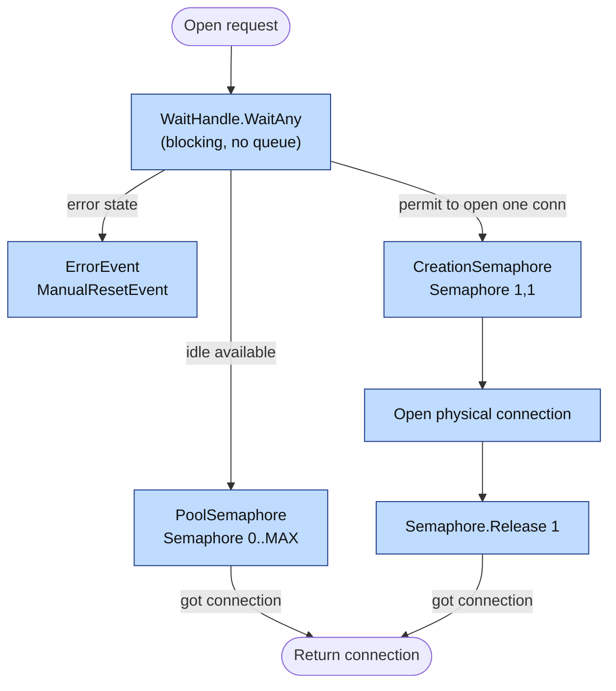
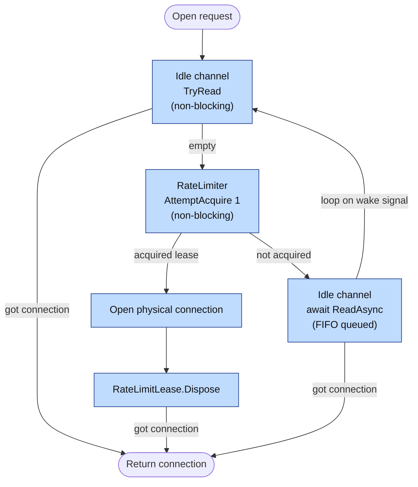

# Rate limiting comparison

## Existing rate limiting

```mermaid
flowchart TD
    Start([Open request]) --> WaitAny["WaitHandle.WaitAny<br/>(blocking, no queue)"]

    WaitAny -->|idle available| S0["PoolSemaphore<br/>Semaphore 0..MAX"]
    WaitAny -->|error state| S1["ErrorEvent<br/>ManualResetEvent"]
    WaitAny -->|permit to open one conn| S2["CreationSemaphore<br/>Semaphore 1,1"]

    S0 -->|got connection| Done([Return connection])
    S2 --> Open["Open physical connection"]
    Open --> Release["Semaphore.Release 1"]
    Release -->|got connection| Done

    classDef prim fill:#bfdbfe,stroke:#1e3a8a,color:#111
    class WaitAny,S0,S1,S2,Open,Release prim
```

## New rate limiting

```mermaid
flowchart TD
    Start([Open request]) --> Idle["Idle channel<br/>TryRead<br/>(non-blocking)"]

    Idle -->|got connection| Done([Return connection])
    Idle -->|empty| Limiter["RateLimiter<br/>AttemptAcquire 1<br/>(non-blocking)"]

    Limiter -->|acquired lease| Open["Open physical connection"]
    Limiter -->|not acquired| Channel["Idle channel<br/>await ReadAsync <br/>(FIFO queued)"]

    Open --> Lease["RateLimitLease.Dispose"]
    Lease --> |got connection| Done
    Channel -->|loop on wake signal| Idle
    Channel --> |got connection| Done

    classDef prim fill:#bfdbfe,stroke:#1e3a8a,color:#111
    class Idle,Limiter,Open,Lease,Channel prim
```