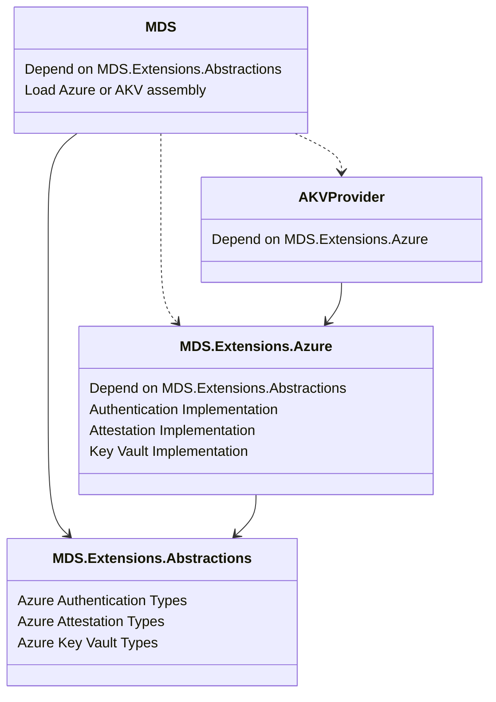

# MDS Azure Extension Design

## Overview

For the MDS 7.0.0 release, we are proposing the following package architecture
changes that will decouple several large dependencies from MDS and move them
into a new `Azure` extension package:

- Create a new `Abstractions` package that all other MDS packages depend on.
  - This will contain types and definitions common to the other MDS packages,
    such as base classes, enums, delegates, etc.
- Create a new `Azure` package that will own the following implementations:
  - Azure Authentication
  - Azure Attestation
  - Azure Key Vault interactions
- Move the above implementations out of MDS and into the new `Azure` package.
- Move the existing `AzureKeyVaultProvider` (AKV) implementation into the new
  `Azure` extension package.

This will reduce the main MDS package dependency tree along with a moderate
package size reduction.

## Motivation

Issue: [#1108](https://github.com/dotnet/SqlClient/issues/1108)

Customers and the developer community have voiced concerns with MDS being
tightly coupled to Azure dependencies.  Many customers do not use Azure and do
not want to deploy unnecessary DLLs with their applications.

Moving the Azure dependent implementations into a separate `Azure` extension
package achieves two goals:

- Remove Azure packages as direct dependencies of MDS and reduce the MDS
  dependency tree.
- Clearly expose existing MDS extension points, prove their functionality, and
  demonstrate how to use them.

The following dependencies will be removed from the main MDS package:

- `Azure.Identity`
  - `Azure.Core` (transitive)
  - `Microsoft.Identity.Client` (transitive)
- `Microsoft.IdentityModel.JsonWebTokens`
  - `Microsoft.IdentityModel.Tokens` (transitive)
  - `Microsoft.IdentityModel.Logging` (transitive)
- `Microsoft.IdentityModel.Protocols.OpenIdConnect`
  - `Microsoft.IdentityModel.Protocols` (transitive)

The following dependencies will be removed from the AKV Provider package:

- `Azure.Core`
- `Azure.Security.KeyVault.Keys`

## Package Architecture



In previous MDS versions, the AKV package depended directly on the main MDS
package through a ranged version (for example [6.0.0, 7.0.0) - all 6.x
versions).  With the new package architecture this is no longer the case.
Extension packages will not depend on the main MDS package, nor will the main
MDS package depend on any extension packages.  All dependencies between MDS and
its extensions will occur through the `Abstractions` package.

This new looser coupling gives applications the flexibility to depend on only
the main MDS package, or on MDS and a subset of it extension packages if
desired.

## Consuming

There are several ways that applications may consume MDS and its extensions:

- MDS without Azure features
- MDS with MDS-supplied Azure features
- MDS with externally supplied Azure features

Applications never need to directly depend on the `Abstractions` base package.
This will be transitively depended on by other MDS packages.

### Without Azure Features

Applications that do not use any Azure features will no longer bring in those
unwanted dependencies transitively.  Simply include the main MDS package by
itself:

```xml
<ItemGroup>
  <PackageReference Include="Microsoft.Data.SqlClient" Version="7.0.0" />
</ItemGroup>
```

Calls to MDS APIs that require Azure features will throw an exception, since
no Azure feature implementation is present.

### With MDS Azure Features

Applications that wish to use MDS-supplied Azure features will need to include
the new `Azure` extension package as a direct dependency alongside the main MDS
package:

```xml
<ItemGroup>
  <PackageReference Include="Microsoft.Data.SqlClient" Version="7.0.0" />
  <PackageReference Include="Microsoft.Data.SqlClient.Extensions.Azure" Version="1.0.0" />
</ItemGroup>
```

MDS will automatically detect the `Azure` extension assemblies and load them.

### With External Azure Features

Applications that wish to use Azure features supplied by another (non-MDS)
package will need to include that package as a direct dependency alongside the
main MDS package:

```xml
<ItemGroup>
  <PackageReference Include="Microsoft.Data.SqlClient" Version="7.0.0" />
  <PackageReference Include="My.Azure.Features.Package" Version="1.2.3" />
</ItemGroup>
```

Additionally, applications will need to instruct MDS to use the external Azure
feature implementations via the appropriate APIs at runtime:

- Authentication: [SqlAuthenticationProvider](https://learn.microsoft.com/en-us/dotnet/api/microsoft.data.sqlclient.sqlauthenticationprovider?view=sqlclient-dotnet-core-6.0)
- Attestation: _**New API will be exposed.**_
- Key Valut: [SqlColumnEncryptionKeyStoreProvider](https://learn.microsoft.com/en-us/dotnet/api/microsoft.data.sqlclient.sqlcolumnencryptionkeystoreprovider?view=sqlclient-dotnet-core-6.0)

## Versioning Strategy

The MDS suite of packages will be versioned independently.  This provides
flexibility to update APIs and implementations for packages as needed, avoiding
unnecessary version bumps and releases.  The initial release of these packages
will have the following versions:

|Package|Version|Comment|
|-|-|-|
|`Microsoft.Data.SqlClient.Extensions.Abstractions`|1.0.0|First version of this package.|
|`Microsoft.Data.SqlClient`|7.0.0|Major version bump due to breaking changes described in this document.|
|`Microsoft.Data.SqlClient.Extensions.Azure`|1.0.0|First version of this package.|
|`Microsoft.Data.SqlClient.AlwaysEncrypted.AzureKeyVaultProvider`|7.0.0|_**Deprecated.**_|

Going forward, each package will be versioned appropriately based on the nature
of the changes included with subsequent releases.

**Note**: The `AzureKeyVaultProvider` package will remain at 7.0.0.  It will be
deprecated and eventually removed, as it has been replaced by the `Azure`
extension package.

## Intradependence

The main MDS package and the new `Azure` package will depend on the
`Abstractions` package.  When APIs are added, modified, or removed from the
`Abstractions` package, corresponding changes will be made to the dependent
packages as well.  Those dependent packages will then take a strict dependency
on the appropriate `Abstractions` package version.  This ensures that only
compatible extensions package versions can co-exist with the main MDS package.

For example, imagine that a new extensible conenction pooling feature is added
to MDS.  The `Abstractions` package would be updated to include any new pooling
APIs, the main MDS package would be updated to accept extensible pooling, and
the new pooling implementation would be included in a new `ConnectionPooling`
extension package.  The versions of these packages would look something like
this:

|Package|Version|
|-|-|
|`Microsoft.Data.SqlClient.Extensions.Abstractions`|1.1.0|
|`Microsoft.Data.SqlClient`|7.1.0|
|`Microsoft.Data.SqlClient.Extensions.ConnectionPooling`|1.0.0|

Both the main MDS package and the new `ConnectionPooling` package would depend
on `Abstractions` v1.1.0.

An application wishing to use the new `ConnectionPooling` v1.0.0 package must
also update the main MDS package to v7.1.0.  The application would not be able
to use `ConnectionPooling` v1.0.0 and MDS v7.0.0.

## Backwards Compatibility

There are several backwards compatibility scenarios to consider for applications
that rely on MDS Azure features currently implemented in the main MDS package
and the AKV package.  The new extensions package architecture aims to reduce the
friction for these apps, but not all scenarios will be seamless.

All of the scenarios below assume that the application is upgrading to the
latest versions of MDS packages.

### Apps using MDS Azure Authentication

Applications currently using the MDS-supplied Azure Authentication features will
need to add a dependency on the `Azure` extension package to their project
alongside the main MDS package:

```xml
<ItemGroup>
  <PackageReference Include="Microsoft.Data.SqlClient" Version="7.0.0" />
  <PackageReference Include="Microsoft.Data.SqlClient.Extensions.Azure" Version="1.0.0" />
</ItemGroup>
```

All Azure Authentication namespaces and types will remain the same, so this
should be the only change necessary for applications.

### Apps using MDS Azure Attestation

Applications currently using the MDS-supplied Azure Attestation features will
need to add a dependency on the `Azure` extension package to their project
alongside the main MDS package:

```xml
<ItemGroup>
  <PackageReference Include="Microsoft.Data.SqlClient" Version="7.0.0" />
  <PackageReference Include="Microsoft.Data.SqlClient.Extensions.Azure" Version="1.0.0" />
</ItemGroup>
```

All Azure Attestation namespaces and types will remain the same, so this should
be the only change necessary for applications.

### Apps using AKV Provider

Applications currently using the MDS-supplied AKV provider will have two options
when upgrading to MDS v7.0.0.  Both options rely on the main MDS package finding
and loading an appropriate DLL (assembly) at runtime.  The absence of an
appropriate DLL will cause Azure Key Vault operations to throw an exception.

#### Use Azure Extension

This is the preferred approach.  The application would be updated to depend
on the main MDS package and the `Azure` extension package:

```xml
<ItemGroup>
  <PackageReference Include="Microsoft.Data.SqlClient" Version="7.0.0" />
  <PackageReference Include="Microsoft.Data.SqlClient.Extensions.Azure" Version="1.0.0" />
</ItemGroup>
```

The `Azure` extension package will contain the same namespaces and types as the
current AKV provider and will be a drop-in replacement.  The main MDS v7.0.0
package will look for the `Azure` extension assembly and automatically load it.

#### Use AKV Provider v7.0.0

This is a temporary solution.  The AKV provider v7.0.0 will be marked as
deprecated and removed entirely at some point in the future.  The applictaion
would remain dependent on the AKV provider, but must update to the v7.0.0
package.  Previous AKV package versions do not support main MDS package versions
beyond the v6.x range.

```xml
<ItemGroup>
  <PackageReference Include="Microsoft.Data.SqlClient" Version="7.0.0" />
  <PackageReference Include="Microsoft.Data.SqlClient.AlwaysEncrypted.AzureKeyVaultProvider" Version="7.0.0" />
</ItemGroup>
```

This AKV Provider v7.0.0 package will be empty and simply depend on the `Azure`
extension package to transitively provide the Azure Key Vault features.
