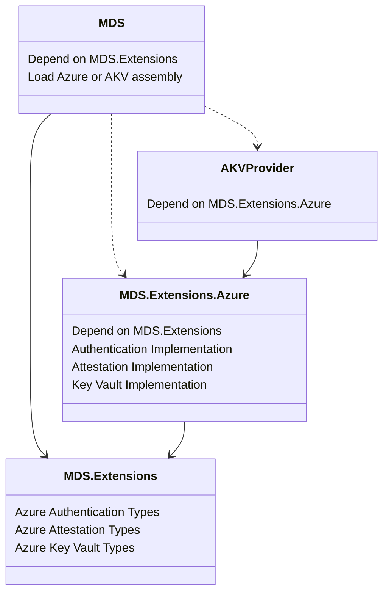

Decoupling Azure Dependencies

# Overview

For the MDS 7.0.0 release, we are proposing the following package architecture
changes that will decouple several large dependencies from MDS and move them
into a new Azure extensions package:

- Create a new Extensions base package that all other MDS packages depend on.
  - This will contain types and definitions common to the other MDS packages,
    such as base classes, enums, delegates, etc.
- Create a new Azure package that will own the following implementations:
  - Azure Authentication
  - Azure Attestation
  - Azure Key Vault interactions
- Move the above implementations out of MDS and into the new Azure package.
- Move the existing Azure Key Vault Provider implementation into the new Azure
  extensions package.

This will reduce the main MDS package dependency tree along with a moderate
package size reduction.

# Motivation

Issue: #1108

Customers and the developer community have voiced concerns with MDS being
tightly coupled to Azure dependencies.  Many customers do not use Azure and do
not want to deploy unnecessary DLLs with their applications.

Moving the Azure dependent implementations into a separate Azure extensions
package achieves two goals:

- Remove Azure packages as direct dependencies of MDS and reduce the MDS
  dependency tree.
- Clearly expose existing MDS extension points, prove their functionality, and
  demonstrate how to use them.

# Package Architecture



In previous MDS versions, the AKV Provider package depended directly on the main
MDS package through a ranged version (for example [6.0.0, 7.0.0) - all 6.x
versions).  With the new package architecture this is no longer the case.
Extension packages will not depend on the main MDS package, nor will the main
MDS package depend on any Extension packages.  All dependencies between MDS and
its extensions will occur through the Extensions base package.

This new looser coupling gives applications the flexibility to depend on only
the main MDS package, or on MDS and a subset of it extension packages if
desired.

# Consuming

There are several ways that applications may consume MDS and its extensions:

- MDS with without Azure features
- MDS with MDS-supplied Azure features
- MDS with externally supplied Azure features

Applications never need to directly depend on the Extensions base package.  This
will be transitively depended on by other MDS packages.

## Without Azure Features

Applications that do not use any Azure features will no longer bring in those
unwanted dependencies transitively.  Simply include the main MDS package by
itself:

```xml
<ItemGroup>
  <PackageReference Include="Microsoft.Data.SqlClient" Version="7.0.0" />
</ItemGroup>
```

## With MDS Azure Features

Applications that wish to use MDS-supplied Azure features will need to include
the new Azure extensions package as a direct dependency alongside the main MDS
package:

```xml
<ItemGroup>
  <PackageReference Include="Microsoft.Data.SqlClient" Version="7.0.0" />
  <PackageReference Include="Microsoft.Data.SqlClient.Extensions.Azure" Version="7.0.0" />
</ItemGroup>
```

## With External Azure Features

Applications that wish to use Azure features supplied by another (non-MDS)
package will need to include that package as a direct dependency alongside the
main MDS package:

```xml
<ItemGroup>
  <PackageReference Include="Microsoft.Data.SqlClient" Version="7.0.0" />
  <PackageReference Include="My.MDS.Azure.Features.Package" Version="1.2.3" />
</ItemGroup>
```

Additionally, the applications will need to instruct MDS to use the external
Azure feature implementations via the appropriate APIs at runtime:

- Authentication: [SqlAuthenticationProvider](https://learn.microsoft.com/en-us/dotnet/api/microsoft.data.sqlclient.sqlauthenticationprovider?view=sqlclient-dotnet-core-6.0)
- Attestation: TBD
- Key Valut: [SqlColumnEncryptionKeyStoreProvider](https://learn.microsoft.com/en-us/dotnet/api/microsoft.data.sqlclient.sqlcolumnencryptionkeystoreprovider?view=sqlclient-dotnet-core-6.0)

# Versioning Strategy

The MDS suite of packages will be versioned together, similar to how .NET system
packages are versioned with the major .NET version.  The initial release of
these packages will have the following versions:

|Package|Version|
|-|-|
|Microsoft.Data.SqlClient.Extensions|7.0.0|
|Microsoft.Data.SqlClient.|7.0.0|
|Microsoft.Data.SqlClient.Extensions.Azure|7.0.0|
|Microsoft.Data.SqlClient.AlwaysEncrypted.AzureKeyVaultProvider|7.0.0|

Going forward, the suite will be released with matching version numbers as
changes are made.  For example, if the next release is v7.1.0, the packages
will be versioned as follows and released together:

|Package|Version|
|-|-|
|Microsoft.Data.SqlClient.Extensions|7.1.0|
|Microsoft.Data.SqlClient.|7.1.0|
|Microsoft.Data.SqlClient.Extensions.Azure|7.1.0|

**Note**: The AzureKeyVaultProvider package will remain at 7.0.0.  It will be
deprecated and eventually removed, as it has been replaced by the Azure
extensions package.

To ensure compatibility between the main MDS package and its extensions, all
packages will maintain a strict dependency on their matching Extensions base
package version.  Once an application depends on a specific MDS package version,
and it chooses to use an extension package, it will be forced to also to depend
on the matching version of that extension package.

For example, the following scenario would fail during NuGet restore because
the Azure extension package depends on a different version of the Extensions
base package than the main MDS package:

|Package|Version|Extensions Base Version|
|-|-|-|
|Microsoft.Data.SqlClient.|7.1.0|7.1.0|
|Microsoft.Data.SqlClient.Extensions.Azure|7.0.0|7.0.0|

# Backwards Compatibility

There are several backwards compatibility scenarios to consider for applications
that rely on MDS Azure features currently living in the main MDS package and the
Azure Key Vault Provider package.  The new extensions package architecture aims
to reduce the friction for these apps, but not all scenarios will be seamless.

All of the scenarios below assume that the application is upgrading to the MDS
7.0.0 suite of packages.

## App using MDS Azure Authentication

Applications currently using the MDS-supplied Azure Authentication features will
need to add a dependency to the Azure extension package to their project
alongside the main MDS package:

```xml
<ItemGroup>
  <PackageReference Include="Microsoft.Data.SqlClient" Version="7.0.0" />
  <PackageReference Include="Microsoft.Data.SqlClient.Extensions.Azure" Version="7.0.0" />
</ItemGroup>
```

All Azure Authentication namespaces and types will remain the same, so this
should be the only change necessary for applications.

## App using MDS Azure Attestation

TBD

## App using AKV Provider

Applications currently using the MDS-supplied AKV Provider will have three
options when upgrading to the v7.0.0 suite of packages.  All options rely on the
main MDS package finding and loading an appropriate DLL (assembly) at runtime.
The absence of an appropriate DLL will cause Azure Key Vault operations to throw
an exception.

### Use Azure Extension

This is the preferred approach.  The application would be updated to depend
on the main MDS package and the Azure extensions package:

```xml
<ItemGroup>
  <PackageReference Include="Microsoft.Data.SqlClient" Version="7.0.0" />
  <PackageReference Include="Microsoft.Data.SqlClient.Extensions.Azure" Version="7.0.0" />
</ItemGroup>
```

The Azure extensions package will contain the same namespaces and types as the
current AKV Provider and will be a drop-in replacement.  The main MDS v7.0.0
package will look for the Azure extensions assembly and automatically load it.

### Use AKV Provider v7.0.0

This is a temporary solution and will removed in a future release.  The
applictaion would remain dependent on the AKV Provider, but must update to
the v7.0.0 package to match the main MDS version:

```xml
<ItemGroup>
  <PackageReference Include="Microsoft.Data.SqlClient" Version="7.0.0" />
  <PackageReference Include="Microsoft.Data.SqlClient.AlwaysEncrypted.AzureKeyVaultProvider" Version="7.0.0" />
</ItemGroup>
```

This v7.0.0 AKV Provider package will be empty and simply depend on the Azure
extensions package to provide the Azure Key Vault features.  This transitional
package will be deprecated and eventually removed.

### Use AKV Provider pre-v7.0.0

This is not a recommended approach and will not be supported, although it will
may work in the near term.  While MDS will retain its ability to find and load
the AKV Provider DLL (see the approach above), there is no guarantee that an
older DLL will provide the functionality expected by the main MDS package.

```xml
<ItemGroup>
  <PackageReference Include="Microsoft.Data.SqlClient" Version="7.0.0" />
  <PackageReference Include="Microsoft.Data.SqlClient.AlwaysEncrypted.AzureKeyVaultProvider" Version="6.1.0" />
</ItemGroup>
```

Note that the above example would fail to NuGet restore if the AKV Provider
package didn't advertise that it depends on at least MDS v7.0.0.
